# Целевая архитектура нового приложения и AI Delivery Shell

## 1. Архитектурная идея

Новый репозиторий должен состоять из двух плоскостей:

1. **AI Delivery Control Plane** — управляет тем, как ведётся разработка.
2. **Application Plane** — содержит приложение `Trading Advisor 3000`.

Это важное разделение:  
мы не хотим, чтобы governance-shell был спрятан внутри бизнес-модуля, и не хотим, чтобы приложение зависело от process history.

## 2. Плоскости системы

### 2.1. AI Delivery Control Plane
Содержит:
- `AGENTS.md`
- `docs/agent/*`
- `docs/agent-contexts/*`
- `docs/checklists/*`
- `docs/workflows/*`
- `docs/runbooks/*`
- `docs/session_handoff.md`
- `plans/*`
- `memory/*`
- `scripts/*` (task_session, gates, validators, reports)
- `tests/process/*`
- CI workflows
- hooks / CODEOWNERS / `.cursorignore`

### 2.2. Application Plane
Содержит:
- `src/trading_advisor_3000/`
- прикладные модули
- app-level tests
- app contracts
- adapters/integrations
- UI/API surfaces (если появятся)

## 3. Логическая схема

```mermaid
flowchart LR
    U[Task request] --> T[task_session begin]
    T --> N[docs/tasks/active/<task>.md]
    N --> C[validate_task_request_contract]
    C --> R[context_router + context cards]
    R --> L[run_loop_gate]
    L --> A[src/trading_advisor_3000]
    A --> P[run_pr_gate]
    P --> E[task_session end]
    E --> S[plans/items + memory + task_outcomes + handoff]
    S --> D[dashboard + reports + CI history]
```



## 4. Рекомендуемая структура репозитория

```text
/
├─ AGENTS.md
├─ CODEOWNERS
├─ .cursorignore
├─ .githooks/
│  └─ pre-push
├─ .cursor/
│  └─ skills/
├─ docs/
│  ├─ README.md
│  ├─ DEV_WORKFLOW.md
│  ├─ session_handoff.md
│  ├─ agent/
│  ├─ agent-contexts/
│  ├─ checklists/
│  ├─ planning/
│  ├─ workflows/
│  ├─ runbooks/
│  ├─ architecture/
│  └─ tasks/
│     ├─ active/
│     └─ archive/
├─ plans/
│  ├─ items/
│  └─ PLANS.yaml
├─ memory/
│  ├─ agent_memory.yaml
│  ├─ task_outcomes.yaml
│  ├─ decisions/
│  ├─ incidents/
│  └─ patterns/
├─ scripts/
├─ src/
│  └─ trading_advisor_3000/
├─ tests/
│  ├─ process/
│  ├─ architecture/
│  └─ app/
└─ .github/
   └─ workflows/
```

## 5. Слои control plane

### Layer A — Entry & policy
- `AGENTS.md`
- `docs/agent/*`
- `.cursorignore`
- `CODEOWNERS`

Задача: определить, что читать, что считать source-of-truth, кто владеет поверхностями.

### Layer B — Session & durable task state
- `task_session.py`
- `docs/session_handoff.md`
- `docs/tasks/*`
- `plans/*`
- `memory/*`

Задача: сделать каждую задачу воспроизводимой и передаваемой между AI-сессиями.

### Layer C — Routing & boundaries
- `context_router.py`
- `docs/agent-contexts/*`
- architecture docs
- ownership maps

Задача: сузить контекст и явно описать зоны ответственности.

### Layer D — Validation & gates
- `compute_change_surface.py`
- `run_loop_gate.py`
- `run_pr_gate.py`
- `run_nightly_gate.py`
- validators

Задача: machine-enforce правила, не замедляя hot loop.

### Layer E — Measurement & feedback
- `measure_dev_loop.py`
- `agent_process_telemetry.py`
- `process_improvement_report.py`
- `build_governance_dashboard.py`
- `autonomy_kpi_report.py`

Задача: понять, ускоряет ли shell разработку на самом деле.

## 6. Слои application plane (без доменных деталей)

Для `Trading Advisor 3000` в этом ТЗ задаются только рамки, не бизнес-логика.

Рекомендуемые внутренние зоны:

1. `domain/` — термины и правила приложения.
2. `application/` — use cases / orchestration.
3. `adapters/` — внешние системы, storage, transport.
4. `contracts/` — schemas, public interfaces, DTOs.
5. `ui_or_api/` — внешний интерфейс.
6. `ops/` — runtime config / observability hooks.

## 7. Архитектурные правила

1. Control plane не импортирует прикладную логику как runtime dependency.
2. Application plane не должен напрямую изменять process state вне описанных scripts/flows.
3. Любой high-risk contract change идёт отдельной серией патчей.
4. Любой новый значимый каталог должен:
   - попасть в architecture docs;
   - получить owner;
   - получить context coverage;
   - получить минимум один validation path.
5. Если модуль не отражён в docs/architecture и docs/agent-contexts, он считается неполно оформленным.

## 8. Что переиспользовать из исходной архитектуры

### Сохранить
- architecture-as-docs discipline;
- layered map;
- entity model как шаблон;
- sync workflow для architecture map;
- distinction between deterministic and agentic steps.

### Переписать
- все доменные сущности;
- слои, названные вокруг трейдингового продукта;
- интеграционные детали исходного домена.

## 9. Почему это ускорит Codex

Codex работает быстрее, когда:
- знает, какие файлы читать первыми;
- не тащит весь repo в контекст;
- видит явные boundaries;
- получает machine-checkable loop;
- сохраняет состояние в структурированных артефактах.

Эта архитектура делает именно это.
