# Phase 9 Architecture And Stop Rules

## Integration architecture

```mermaid
flowchart LR
    A["MOEX"] --> B["Historical bootstrap"]
    B --> C["Canonical bars and sessions"]
    D["QUIK live feed"] --> E["Runtime market context"]
    C --> F["Research features, backtest, replay"]
    F --> G["Strategy version and risk template"]
    G --> H["Runtime decision engine"]
    E --> H
    H --> I["PostgreSQL signal state"]
    I --> J["Telegram shadow/advisory channel"]
    H --> K["Prometheus / Loki / Grafana"]
    J --> K

    H --> L["HTTP sidecar gateway"]
    L --> M["StockSharp sidecar"]
    M --> N["QUIK broker hop"]
    N --> O["Finam"]
    O --> P["Broker orders, fills, positions"]
    P --> Q["Sync and reconciliation"]
    Q --> I
    Q --> K
```

## Decision rules

### Rule 1 - named external systems are part of the contract
Phase 9 docs must explicitly name `MOEX`, `QUIK`, `Telegram`, `PostgreSQL`,
`HTTP sidecar gateway`, `StockSharp`, `Finam`, `Prometheus / Loki / Grafana`, and `MCP`.

### Rule 2 - QUIK roles must stay separate
`QUIK` as live feed belongs to Phase 9A. `QUIK` as broker-route hop belongs to Phase 9B.
No acceptance note may merge these two closures.

### Rule 3 - battle runs are not allowed without PostgreSQL
In-memory runtime state is acceptable for unit/dev smoke only.
Battle-run mode must use `PostgreSQL`.

### Rule 4 - broker side effects remain gated
No live submit is allowed without:
- feature flags,
- green readiness checks,
- operator approval,
- kill-switch availability,
- evidence collection enabled.

### Rule 5 - support surfaces stay support-only
`MCP` may assist diagnostics and readonly inspection, but it is never a runtime dependency
and must never hold live broker credentials.

## Stop rules

Stop the active battle-run or canary cycle immediately when any of the following happens:

1. `MOEX` bootstrap fails or produces unusable gaps for the frozen pilot universe.
2. `QUIK` live feed is stale outside the documented freshness window.
3. `Telegram` duplicates a message after restart or retry.
4. `PostgreSQL` runtime state cannot be reconciled after restart.
5. observability snapshots from `Prometheus / Loki / Grafana` are missing for a required run.
6. `HTTP sidecar gateway` readiness is red or unstable.
7. `StockSharp` cannot map broker feedback back to `intent_id`.
8. `Finam` canary produces unexpected position drift or unmapped fill.

## Kill-switches

### Runtime kill-switch
- stop new signals
- keep monitoring on
- allow only explicit close/cancel actions

### Publication kill-switch
- stop new `Telegram` create operations
- allow corrective edit/close only under operator control

### Execution kill-switch
- stop new live submits
- keep sync and reconciliation running

### Gateway kill-switch
- block new sidecar accepts
- preserve history, health, and metrics endpoints

## Operational limits for Phase 9

- frozen pilot universe only
- one historical source: `MOEX`
- one primary live feed: `QUIK`
- one private `Telegram` shadow destination, with optional advisory destination
- tiny sizing for any `Finam` canary
- operator in the loop at all times

## Explicit limitations

1. Current gateway and sidecar surfaces prove contract readiness, not automatic live readiness.
2. Phase 8 proving remains a delivery proof, not a production-acceptance substitute.
3. Battle runs should not claim multi-provider resilience yet.
4. `MCP` is intentionally isolated from broker submission and live secrets.
