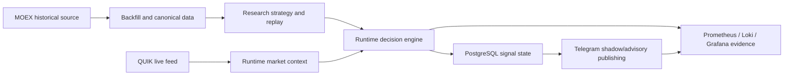
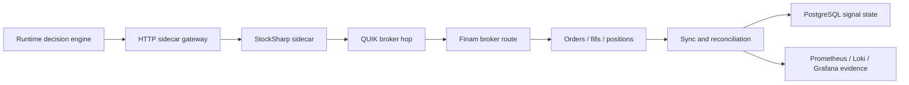

# Phase 9 - Battle Runs And Real Signal Rollout

## Goal

Land a docs-first update that defines the go-live delta from the current baseline
to real-data battle runs and explicit external integration closure.

### Phase 9A - required
- historical data from `MOEX`
- primary live market feed from `QUIK`
- real `Telegram` shadow/advisory signal lifecycle
- `PostgreSQL` as mandatory runtime state store
- reproducible evidence with `Prometheus / Loki / Grafana`

### Phase 9B - optional
- real execution path through `HTTP gateway -> StockSharp -> QUIK -> Finam`
- tiny live canary under operator gate
- reconciliation-clean broker evidence

## External integration freeze

The Phase 9 docs package fixes these named external systems:

| System | Role | Direction | Phase | Protocol / adapter | Secret policy | Health / freshness check | Evidence artifact |
| --- | --- | --- | --- | --- | --- | --- | --- |
| `MOEX` | historical source and backfill | inbound | 9A | provider bootstrap -> canonical builder | env-managed only | backfill success + dataset freshness | bootstrap log, dataset version, roll/session note |
| `QUIK` | primary live market feed | inbound | 9A | live provider adapter | env-managed only | live freshness window + session validity | live smoke report |
| `Telegram` | signal publication and lifecycle | outbound | 9A | runtime publisher -> `Telegram Bot API` transport | bot token + destination ids in env | create/edit/close/cancel lifecycle smoke over Bot API | publication samples, lifecycle audit |
| `PostgreSQL` | durable runtime state | bidirectional | 9A / 9B | signal store + migrations | DSN in env | migration success + restart/idempotency smoke | migration log, restart evidence |
| `Prometheus / Loki / Grafana` | observability and evidence | side-band | 9A / 9B | existing observability bundle | env-managed only | metrics scrape + log capture | metrics snapshot, log snapshot |
| `HTTP sidecar gateway` | network boundary to sidecar | outbound | 9B | wire API v1 | gateway auth in env | `/health`, `/ready`, `/metrics` | readiness snapshots |
| `StockSharp` | execution sidecar process | outbound | 9B | sidecar delivery contract | env-managed only | build/run readiness | version record, build hash |
| `Finam` | broker route after sidecar | outbound | 9B | broker path behind sidecar | broker creds in env only | canary ack/fill/reconcile | canary report, reconciliation report |
| `MCP` | support and inspection only | side-band | 9A / 9B | existing readonly profiles | no broker creds allowed | preflight contract only | MCP preflight note |

## QUIK dual-role rule

`QUIK` is intentionally present in two different roles:

1. `Phase 9A`: primary live market feed for runtime battle runs.
2. `Phase 9B`: one hop inside the execution route `StockSharp -> QUIK -> Finam`.

These roles must stay separate in docs, evidence, and acceptance.
Live data freshness does not prove broker execution readiness.

## End-to-end flows

### Phase 9A

### Phase 9B

## Deliverables

### Architecture
- baseline snapshot
- gap analysis
- rollout and integration matrix
- stop-rules and kill-switch rules
- module-level DoD
- workstreams and patch-set order
- MCP and secrets update

### Operations
- battle-run runbook
- Phase 9 acceptance checklist
- real-broker canary checklist
- strategy spec template
- evidence package template

## Acceptance model

### Phase 9A accepted
- `MOEX` bootstrap evidence is reproducible
- data-plane materialization remains manifest-backed JSONL plus Delta manifests, not physical Delta tables
- `QUIK` live-feed freshness is within allowed window
- `Telegram` lifecycle shows 10+ correct signal runs
- battle-run mode uses `PostgreSQL`
- observability snapshots are attached
- Phase 8 proving is green on the landing diff

### Phase 9B accepted
- actual `StockSharp` delivery mode is frozen
- `HTTP gateway` readiness is green
- canary through `StockSharp -> QUIK -> Finam` is evidenced
- reconciliation is clean or explicitly owner-approved
- kill-switch proof is attached

## Out of scope

- multi-provider live-feed balancing
- autonomous live trading
- mass universe expansion
- direct broker integration without sidecar
- making `MCP` a runtime dependency
