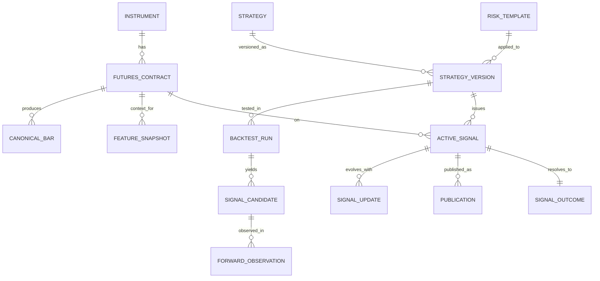

# 03. Data Model and Flows

## 1. Хранилища

### Delta Lake
Используется для:
- `raw.*`
- `canonical.*`
- `feature.*`
- `research.*`
- `analytics.*`

### PostgreSQL
Используется для:
- `config.*`
- `signal.*`
- `execution.*`

## 2. Основные сущности

## 2.1 Raw layer

### `raw.market_events`
- provider
- batch_id
- event_type
- symbol_raw
- event_ts
- ingested_at
- payload_json

### `raw.reference_snapshots`
- provider
- snapshot_type
- as_of_date
- object_key
- payload_json
- ingested_at

## 2.2 Canonical layer

### `canonical.instruments`
- instrument_id
- exchange
- asset_class
- base_symbol
- description

### `canonical.contracts`
- contract_id
- instrument_id
- exchange_symbol
- expiry_date
- tick_size
- lot_size

### `canonical.session_calendar`
- trade_date
- market
- session_type
- open_ts
- close_ts
- is_trading_day

### `canonical.bars`
- contract_id
- instrument_id
- timeframe
- ts
- open
- high
- low
- close
- volume
- open_interest

### `canonical.top_of_book` *(optional for MVP)*
- contract_id
- ts
- bid_price
- ask_price
- bid_size
- ask_size

### `canonical.roll_map`
- instrument_id
- from_contract_id
- to_contract_id
- roll_from_ts
- roll_to_ts
- roll_rule

### `canonical.continuous_bars`
- instrument_id
- timeframe
- ts
- open
- high
- low
- close
- volume
- continuous_rule

## 2.3 Feature layer

### `feature.snapshots`
- contract_id
- instrument_id
- timeframe
- ts
- feature_set_version
- regime
- atr
- ema_fast
- ema_slow
- donchian_high
- donchian_low
- rvol
- features_json

## 2.4 Research layer

### `research.backtest_runs`
- backtest_run_id
- strategy_version_id
- dataset_version
- started_at
- finished_at
- status
- params_hash

### `research.signal_candidates`
- candidate_id
- backtest_run_id
- strategy_version_id
- contract_id
- timeframe
- ts_signal
- side
- entry_ref
- stop_ref
- target_ref
- score

### `research.forward_observations`
- forward_obs_id
- candidate_id
- mode
- opened_at
- closed_at
- result_state
- pnl_r
- mfe_r
- mae_r

## 2.5 Analytics layer

### `analytics.signal_outcomes`
- signal_id
- strategy_version_id
- contract_id
- mode
- opened_at
- closed_at
- pnl_r
- mfe_r
- mae_r
- close_reason

### `analytics.strategy_metrics_daily`
- trade_date
- strategy_version_id
- instrument_id
- mode
- signals_count
- wins_count
- win_rate
- avg_r
- sum_r
- max_dd_r

## 2.6 Config/runtime/execution in PostgreSQL

### `config.strategies`
- strategy_id
- name
- family
- status

### `config.strategy_versions`
- strategy_version_id
- strategy_id
- version
- params_json
- risk_template_id
- allowed_universe
- allowed_timeframes
- status
- activated_from

### `config.risk_templates`
- risk_template_id
- stop_model
- sizing_model
- max_parallel_positions
- roll_blackout_rule
- session_rule
- exposure_rule

### `signal.active_signals`
- signal_id
- strategy_version_id
- contract_id
- mode
- state
- side
- entry_price
- stop_price
- target_price
- opened_at
- expires_at

### `signal.signal_events`
- event_id
- signal_id
- event_ts
- event_type
- reason_code
- payload_json

### `signal.publications`
- publication_id
- signal_id
- channel
- message_id
- publication_type
- published_at
- status

### `execution.order_intents`
- intent_id
- signal_id
- mode
- broker_adapter
- action
- contract_id
- qty
- price
- stop_price
- created_at

### `execution.broker_orders`
- broker_order_id
- intent_id
- external_order_id
- broker
- state
- submitted_at
- updated_at

### `execution.broker_fills`
- fill_id
- broker_order_id
- fill_ts
- qty
- price
- fee
- external_trade_id

### `execution.positions`
- position_key
- account_id
- contract_id
- mode
- qty
- avg_price
- as_of_ts

### `execution.account_risk_snapshots`
- account_id
- as_of_ts
- available_cash
- margin_required
- margin_free
- broker_limits_json

### `execution.broker_event_log`
- event_id
- broker_adapter
- external_object_id
- event_type
- event_ts
- payload_json

## 3. Сквозные ключи

Обязательные идентификаторы:
- `instrument_id`
- `contract_id`
- `strategy_version_id`
- `signal_id`
- `intent_id`

## 4. Основные потоки данных

### Поток 1. Рыночные данные
`raw.market_events`
→ `canonical.contracts / instruments / session_calendar`
→ `canonical.bars`
→ `feature.snapshots`

### Поток 2. Research
`canonical.bars + feature.snapshots + config.strategy_versions`
→ `research.backtest_runs`
→ `research.signal_candidates`
→ `research.forward_observations`

### Поток 3. Live advisory
`canonical.bars + config.strategy_versions`
→ `signal.active_signals`
→ `signal.signal_events`
→ `signal.publications`

### Поток 4. Live execution
`signal.active_signals`
→ `execution.order_intents`
→ `StockSharp sidecar / QUIK / broker`
→ `execution.broker_orders`
→ `execution.broker_fills`
→ `execution.positions`

### Поток 5. Аналитика
`signal.signal_events + execution.broker_fills + execution.positions`
→ `analytics.signal_outcomes`
→ `analytics.strategy_metrics_daily`

## 5. ERD

## 6. Ключевые ограничения модели данных

1. `continuous_bars` не используются для live execution.
2. Snapshot tables не заменяют event tables.
3. Broker snapshots не генерируются из предположений — только из broker events и sync.
4. Любые derived metrics должны быть воспроизводимы из event logs.
