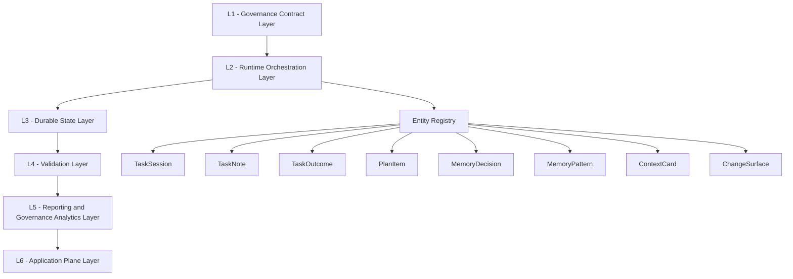

<!-- generated-by: scripts/sync_architecture_map.py -->
<!-- generated-at: 2026-03-20 -->
# Architecture Map v2

```mermaid
flowchart TB
  L1["L1 - Governance Contract Layer"]
  L2["L2 - Runtime Orchestration Layer"]
  L1 --> L2
  L3["L3 - Durable State Layer"]
  L2 --> L3
  L4["L4 - Validation Layer"]
  L3 --> L4
  L5["L5 - Reporting and Governance Analytics Layer"]
  L4 --> L5
  L6["L6 - Application Plane Layer"]
  L5 --> L6
  E0["Entity Registry"]
  E1["TaskSession"]
  E0 --> E1
  E2["TaskNote"]
  E0 --> E2
  E3["TaskOutcome"]
  E0 --> E3
  E4["PlanItem"]
  E0 --> E4
  E5["MemoryDecision"]
  E0 --> E5
  E6["MemoryPattern"]
  E0 --> E6
  E7["ContextCard"]
  E0 --> E7
  E8["ChangeSurface"]
  E0 --> E8
  L2 --> E0
```
