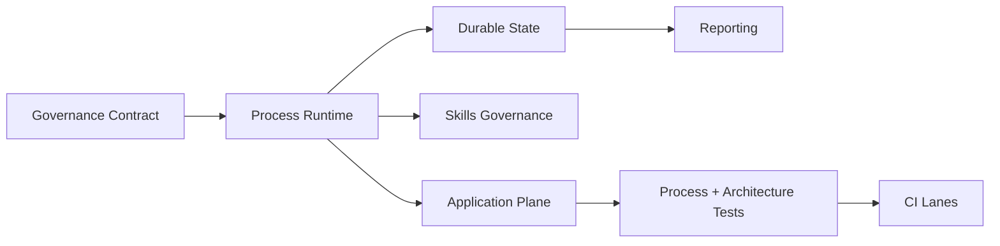

# Architecture Map

```mermaid
flowchart LR
  A["Governance Contract"] --> B["Process Runtime"]
  B --> C["Durable State"]
  B --> D["Skills Governance"]
  C --> E["Reporting"]
  B --> F["Application Plane"]
  F --> G["Process + Architecture Tests"]
  G --> H["CI Lanes"]
```
