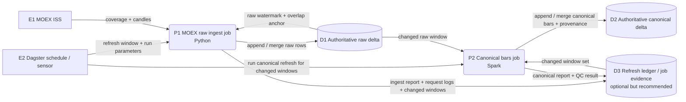
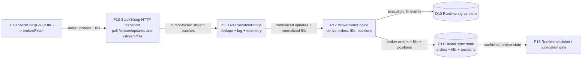

# MOEX Historical Route Architecture

## Purpose
Define the target architecture for MOEX historical refresh after the 4-year baseline was pinned.

This document exists to replace the current "full rerun candidate snapshot" nightly model with a controlled incremental refresh model.

See also:
- [moex-historical-route-decision.md](docs/architecture/product-plane/moex-historical-route-decision.md) for the authoritative entrypoint and cleanup decision.

## Current Reality

### What is already good
- A successful 4-year baseline is pinned in the data-root layout:
  - raw: `D:/TA3000-data/trading-advisor-3000-nightly/raw/moex/baseline-4y-current`
  - canonical: `D:/TA3000-data/trading-advisor-3000-nightly/canonical/moex/baseline-4y-current`
- Phase-01 foundation now has request-level logs, item-level failure artifacts, chunked MOEX fetch windows, and shard-level failure visibility.

### What is currently wrong
- The current nightly runner builds a fresh candidate run with `bootstrap_window_days=1461` instead of extending the retained baseline.
- Dagster-owned orchestration is already implemented for the canonical route, but governed staging-real acceptance evidence is still pending for full Dagster-route closure.
- Heavy canonical refresh currently runs through the current Python contour, while Spark exists only as a partial parallel contour and not as the active MOEX nightly compute path.
- As a result, nightly is too expensive and too close to a "rebuild the world" model.

## Design Principles
1. There should be one obvious directional flow of historical data.
2. Nightly refresh must ingest only delta plus controlled overlap, not the full 4-year horizon.
3. Python should own external connector behavior, request chunking, retries, and source-specific quirks.
4. Spark should own heavy canonical recompute and resampling.
5. Dagster should own orchestration and refresh-window control.
6. Runtime hot-path must remain independent from Spark.

## Target DFD

### Nightly Historical Refresh DFD

This DFD is intentionally optimized for operator clarity.
Internal substeps such as contract-chain discovery, request chunking, overlap handling, and detailed QC remain implementation details inside the jobs rather than top-level architecture nodes.

### Current Live Broker State DFD

## Decisions Applied In The DFD
- `P1 MOEX raw ingest job`: Python keeps ownership of source-specific behavior: MOEX HTTP requests, retries, chunking, disconnect handling, overlap control, and watermark logic.
- `P2 Canonical bars job`: Spark owns heavy recompute and resampling because this is batch compute, not connector logic.
- `D1 Authoritative raw delta`: the raw store is long-lived and incrementally extended; nightly is not allowed to rebuild it from scratch by default.
- `D2 Authoritative canonical delta`: canonical is rebuilt only for the changed window set derived from raw refresh, then merged back.
- `D3 Refresh ledger / job evidence`: this is not a mandatory separate product table, but a small technical ledger is recommended for changed-window tracking, audit, and recovery.
- `E10 -> P10 -> P11 -> P12`: the current live broker contour is execution-state sync, not a full historical data-plane replacement.

## Route Ownership Decision
This document defines the target flow shape.
The authoritative routing and cleanup decision lives in:
- [moex-historical-route-decision.md](docs/architecture/product-plane/moex-historical-route-decision.md)

That decision fixes:
- which jobs are allowed to own raw and canonical writes,
- which existing entrypoints stay as manual-only routes,
- which proof contours remain proof-only,
- which manual route is retired from normal operations.

## Target Storage Model

Data-root truth source:
- `D:/TA3000-data/trading-advisor-3000-nightly`

### A. Authoritative raw storage
- Root: `D:/TA3000-data/trading-advisor-3000-nightly/raw/moex/baseline-4y-current`
- Role: append/merge target for validated historical source rows
- Contents:
  - `raw_moex_history.delta`

### B. Authoritative canonical storage
- Root: `D:/TA3000-data/trading-advisor-3000-nightly/canonical/moex/baseline-4y-current`
- Role: append/merge target for canonical bars and provenance over the changed raw window set
- Contents:
  - `canonical_bars.delta`
  - `canonical_bar_provenance.delta`
  - `reports/route-refresh-report.json`
  - `reports/canonical-refresh-report.json`

### C. Derived storage
- Root: `D:/TA3000-data/trading-advisor-3000-nightly/derived/moex`
- Role: reserved data-only space for downstream computed layers that must stay outside the baseline roots.
- Contents:
  - `features/`
  - `indicators/`

### D. Technical ledger
- Optional as a separate store, but recommended.
- Role:
  - keep refresh window metadata
  - record job evidence
  - support replay / recovery / audit
- This may be implemented as:
  - a small Delta technical table,
  - or a JSON/Delta run ledger,
  - or Delta commit metadata if that proves sufficient.

## Target Compute / Orchestration Split

### Python responsibility
Python remains responsible for MOEX-specific ingest behavior:
- contract-chain discovery
- candleborders coverage discovery
- request chunking
- timeout / disconnect retries
- source request logs
- watermark calculation
- raw delta append into candidate raw layer

This is the right place for source-aware logic because Spark is a bad fit for external HTTP retry choreography.

### Spark responsibility
Spark becomes the heavy compute engine for:
- canonical refresh from baseline raw + candidate raw
- deterministic resampling
- provenance rebuild for touched windows
- compact / optimize / maintenance jobs
- optional repair jobs for historical windows

Spark should not be the component that talks directly to MOEX ISS.

### Dagster responsibility
Dagster becomes the orchestrator for:
- schedules
- asset graph
- retries
- quality checks
- promotion gating
- operational visibility
- backfill and rerun management

The Dagster route is now implemented as the canonical orchestration owner. The manual Python tools may still exist only as bounded support entrypoints:
- `scripts/run_moex_raw_ingest.py`
- `scripts/run_moex_canonical_refresh.py`

They are not the target-state operator-facing route under the active governed planning baseline.

## Target Job Set

The optimized nightly contour should expose only two operator-facing data jobs.

### Job 1. `moex_raw_ingest`
- Engine: Python
- Inputs:
  - MOEX ISS
  - current raw watermark from authoritative raw storage
- Outputs:
  - authoritative raw delta append / merge
  - request logs
  - touched-window manifest
  - ingest evidence

### Job 2. `moex_canonical_refresh`
- Engine: Spark
- Inputs:
  - authoritative raw delta
  - touched-window manifest
- Outputs:
  - authoritative canonical bars append / merge
  - authoritative canonical provenance append / merge
  - canonical build evidence

### Orchestration control
- Dagster is responsible for:
  - deciding the refresh window
  - launching Job 1 and Job 2 in order
  - blocking Job 2 if Job 1 fails validation
  - recording run status and retry behavior

## Incremental Refresh Model

### Raw refresh
- Raw storage is incrementally extended.
- Raw ingest processes only:
  - new bars after baseline watermark
  - small configured overlap window for corrections
  - optional bounded repair windows

### Canonical refresh
- Recompute only affected:
  - contracts
  - sessions
  - target timeframes
- Merge refreshed canonical results directly into authoritative canonical storage.

### Retention
- Keep the authoritative raw and canonical stores.
- Keep bounded run evidence and logs.
- Remove failed or superseded run folders once diagnostics are no longer needed.

## Hard Protections For Baseline
1. Only the two sanctioned jobs may write to authoritative raw and canonical stores.
2. Job 1 writes only raw.
3. Job 2 writes only canonical bars and canonical provenance.
4. Dagster controls execution order and blocks cross-step corruption.
5. A technical ledger or equivalent audit trail must record changed windows, run id, and validation outcome.
6. Storage permissions should make accidental ad-hoc mutation difficult outside the controlled jobs.

## Live Broker Data Boundary

### What the policy says
Intraday decisions must use broker live data through the real execution boundary:
- `StockSharp -> QUIK -> broker/Finam`

This is the truth-source rule in [STATUS.md](docs/architecture/product-plane/STATUS.md).

### What is implemented now
The strongest implemented live contour in code today is execution-state sync, not a mature market-data asset pipeline.

Current live path:
1. Runtime builds `LiveExecutionBridge`.
2. If enabled, it binds `stocksharp-sidecar` to `StockSharpHTTPTransport`.
3. HTTP transport polls sidecar endpoints:
   - `/stream/updates`
   - `/stream/fills`
   with cursors and bounded batch size.
4. `ControlledLiveExecutionEngine.poll_broker_sync()` drains those streams.
5. `BrokerSyncEngine` ingests updates and fills, then derives broker orders and positions.
6. Reconciliation compares expected intents/positions with observed broker state.

### Important caveat
This is currently an execution-state path:
- order updates
- fills
- derived positions

It is not yet a fully landed first-class live broker market-data pipeline for quotes/orderbook/bars in the same degree of closure.

## Migration Plan

### Stage 0 - Baseline freeze
- Keep the pinned data-root baseline layout authoritative.
- No more full-horizon nightly rebuilds as the default refresh path.

### Stage 1 - Candidate raw delta
- Introduce a candidate raw root and refresh manifest.
- Compute delta from baseline watermark instead of from an empty run folder.
- Keep Python for source fetch and diagnostics.

### Stage 2 - Spark canonical refresh
- Refactor phase-02 refresh into a Spark-driven candidate canonical job.
- Scope recompute to touched windows and contracts only.

### Stage 3 - Dagster orchestration
- Keep nightly scheduling, retries, and promotion gates in Dagster as the canonical route owner.
- Keep direct Python scripts only as bounded manual debug and repair entrypoints; they are not the operator-facing default path.

### Stage 4 - Promotion hardening
- Read-only baseline outside promotion.
- Promotion manifest, rollback pointer, and retention policy.

### Stage 5 - Live broker market-data closure
- Separate execution-state sync from live market-data feed ingestion.
- Define explicit broker market-data contracts if the runtime is expected to consume them directly.

## Acceptance Conditions For Nightly V2
1. Default nightly reads raw watermark and does not request a full 4-year horizon.
2. Raw ingest writes only delta plus bounded overlap.
3. Canonical refresh is scoped to touched windows.
4. Canonical refresh starts only after raw ingest validation passes.
5. Raw and canonical stores remain long-lived authoritative stores rather than per-run full snapshots.
6. Dagster is the canonical schedule/orchestration layer for the refresh contour.
