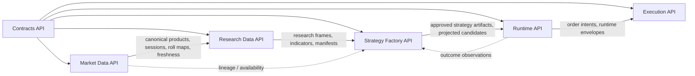

# Product Plane Module APIs

## Purpose

This document defines the target public APIs between product-plane deep modules.
It is one part of the broader modular structure defined in
[product-plane-module-charters.md](docs/architecture/product-plane/product-plane-module-charters.md):

- modular structure defines the modules, ownership, hidden decisions, storage,
  runtime owners, and proof surfaces;
- module APIs define how neighboring modules are allowed to communicate.

This is a target communication map. It does not claim that every API is already
implemented as a stable code package. Current implementation reality remains
owned by [STATUS.md](docs/architecture/product-plane/STATUS.md), and
release-blocking payload contracts remain owned by
[CONTRACT_SURFACES.md](docs/architecture/product-plane/CONTRACT_SURFACES.md).

## Change Surface

`product-plane`

## Core Rule

Product-plane modules are deep modules with narrow public APIs.

Allowed cross-module dependencies:

```text
module -> contracts
module -> other_module.public_api
```

Forbidden cross-module dependencies:

```text
module -> other_module.delta_runtime
module -> other_module.jobs
module -> other_module._common
module -> other_module.internal_storage_helper
module -> other_module.runtime_private_implementation
```

Implementation packages may stay complex. The boundary rule is that complexity
must be hidden behind a small, named public API before another module depends on
it.

## Target API Map



Dashed dependencies are read-only feedback paths. They must stay on public API
surfaces and must not pull private implementation details across module
boundaries.

## API: Contracts

| Field | Decision |
| --- | --- |
| Owner | Contracts |
| Purpose | Provide the shared language used by all product-plane modules. |
| Public API includes | IDs, DTOs, enums, policies, manifests, versioned schemas, fixtures, compatibility classes. |
| Stable examples | Candidate IDs, strategy IDs, run IDs, dataset versions, canonical bars, signal candidates, order intents, live execution policies, release-blocking schemas. |
| Must hide | Schema validation plumbing and fixture organization. |
| Must not own | Storage access, Spark/Delta/vectorbt/Optuna execution, data materialization, strategy computation, runtime behavior, broker transport. |
| Allowed consumers | All product-plane modules. |
| Boundary proof | Contract tests, schema/fixture validation, compatibility inventory checks. |

Contracts are the shared vocabulary, not an execution layer. If a value crosses
module boundaries and must remain stable, it belongs here or must reference a
versioned contract here.

## API: Market Data

| Field | Decision |
| --- | --- |
| Owner | Market Data Foundation |
| Purpose | Expose authoritative market data products and their quality/freshness evidence. |
| Public API includes | Raw/canonical availability, canonical bars, session calendars, roll maps, freshness reports, lineage/provenance, data product manifests. |
| Stable examples | Canonical table roots, session calendar outputs, roll map outputs, pinned baseline metadata, QC reports. |
| Must hide | Provider quirks, source-specific normalization, Delta layout details, Spark job mechanics, raw ingest retry mechanics, `_delta_log` internals. |
| Must not own | Indicator frames, derived technical relationships, strategy search, runtime signal lifecycle, broker execution. |
| Allowed consumers | Research Data API; Strategy Factory API only through explicit read-only availability or lineage surfaces. |
| Boundary proof | Delta log presence, row counts, QC report, pinned baseline, route report, idempotent rerun evidence. |

Market Data API should answer: "which market data product is authoritative,
fresh, and usable?" It should not expose how canonical data was physically
assembled.

## API: Research Data

| Field | Decision |
| --- | --- |
| Owner | Research Data Factory |
| Purpose | Expose research-ready frames and materialization evidence built from canonical market data. |
| Public API includes | Research bar views, continuous-front research views, base indicator frames, derived indicator frames, frame manifests, materialization reports, eligibility/freshness metadata. |
| Stable examples | `research_bar_views`, `research_indicator_frames`, `research_derived_indicator_frames`, materialization manifests, frame version contracts. |
| Must hide | pandas-ta/Spark split, indicator implementation, derived relationship logic, roll-aware mechanics, table replacement strategy, cache behavior. |
| Must not own | Raw/canonical market truth, strategy-family search, vectorbt execution, Optuna state, runtime publication, broker execution. |
| Allowed consumers | Strategy Factory API. |
| Boundary proof | Forced rebuild evidence, Delta log presence, frame row counts, materialization summary, research data-prep tests. |

Research Data API should answer: "which research frame can a strategy safely
consume?" It should not ask strategy code to recompute indicators or understand
materialization internals.

## API: Strategy Factory

| Field | Decision |
| --- | --- |
| Owner | Strategy Factory |
| Purpose | Expose strategy research artifacts produced from research-ready frames. |
| Public API includes | Strategy definitions, campaign specs, backtest requests/results, optimizer runs, rankings, findings, signal candidates, promotion decisions, accepted/rejected research artifacts. |
| Stable examples | Campaign configs, `StrategyFamilySearchSpec`, search result tables, ranking artifacts, projected signal candidates, campaign run summaries. |
| Must hide | Family adapters, matrix assembly, vectorbt broadcasting details, Optuna trial orchestration, ranking implementation, result storage mechanics. |
| Must not own | Canonical market truth, research-frame materialization, runtime publication state, durable runtime store, broker execution. |
| Allowed consumers | Runtime API; operator/reporting tools through explicit public read models. |
| Boundary proof | Campaign summary, Optuna trial rows, vectorbt result outputs, ranking rows, projection rows, benchmark evidence. |

Strategy Factory API should answer: "which strategy artifact is eligible for
runtime consideration?" It should not leak vectorbt, Optuna, or storage layout
details to Runtime Plane.

## API: Runtime

| Field | Decision |
| --- | --- |
| Owner | Runtime Plane |
| Purpose | Convert approved strategy artifacts into runtime decisions and operator-visible signal lifecycle state. |
| Public API includes | Decision candidates, advisory signals, runtime state, lifecycle commands, replay/outcome observations, operator review events, runtime health/readiness. |
| Stable examples | Runtime API envelopes, runtime signal/event/publication contracts, close/cancel/expire commands, durable store protocol. |
| Must hide | Pipeline wiring, store backend implementation, replay mechanics, publication adapter details, bootstrap internals. |
| Must not own | Strategy search, research materialization, canonical data ownership, broker transport implementation. |
| Allowed consumers | Execution API for order-intent handoff; operator/API clients through documented runtime endpoints. |
| Boundary proof | Runtime lifecycle tests, durable-store restart proof, API health/ready smoke, publication lifecycle evidence. |

Runtime API should answer: "what is the current approved signal state, and what
action is allowed next?" It should not import strategy internals or execution
transport details.

## API: Execution

| Field | Decision |
| --- | --- |
| Owner | Execution Plane |
| Purpose | Own order-intent handoff, risk-gated execution transport, broker/process proof, and execution operations. |
| Public API includes | Order intents, risk gate results, paper/live bridge status, execution profile, broker/session state, execution audit trail, sidecar HTTP envelopes. |
| Stable examples | Order intent contracts, broker order/fill/event contracts, execution operational profile endpoints, rollout and broker process reports. |
| Must hide | Broker adapter details, paper/live implementation, secret loading mechanics, sidecar internals, reconciliation implementation. |
| Must not own | Signal generation, strategy search, research materialization, canonical market truth, publication lifecycle policy. |
| Allowed consumers | Runtime API through explicit order-intent and execution-status surfaces; operator tooling through documented operational endpoints. |
| Boundary proof | Sidecar smoke/replay evidence, execution operational profile snapshot/metrics, staging rollout report, broker process report, reconciliation tests. |

Execution API should answer: "what order action can be sent, what happened to
it, and what operational proof exists?" It should not become a strategy or
runtime lifecycle owner.

## First Implementation Target

The first API to implement after this map is the Strategy/Research Artifact
Store API.

Current import inventory has no `review_required` edges, but it still allows a
temporary bridge from Strategy Factory to Market Data Foundation storage helpers.
The target is:

```text
tolerated_bridge: Strategy Factory -> Market Data Foundation storage helper = 0
```

The Strategy Factory should request artifacts through public API operations such
as:

- write backtest results;
- read strategy rankings;
- write campaign manifests;
- read/write signal candidate artifacts;
- read strategy artifact metadata.

The implementation behind that API may use Delta Lake and existing data-plane
helpers, but Strategy Factory callers should not import `data_plane.delta_runtime`
directly.

## Enforcement Path

1. Keep this document as the target API map.
2. Keep
   [product-plane-module-charters.md](docs/architecture/product-plane/product-plane-module-charters.md)
   as the ownership map.
3. Use `python scripts/report_product_plane_module_imports.py --format markdown`
   to inspect current cross-module imports.
4. Convert one tolerated bridge family into a public API.
5. Promote the matching rule from report-only to architecture test.
6. Repeat until `tolerated_bridge` reaches zero for product-plane module imports.

Do not introduce public APIs by wrapping every function. Public APIs should
represent durable module responsibilities: data products, artifacts, lifecycle
commands, operational state, and proof surfaces.
