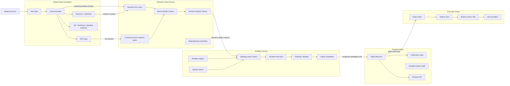

# Product Plane Modular Structure

## Purpose

This document defines the target modular structure of the product plane: the
deep modules, their responsibilities, their hidden decisions, their storage and
runtime ownership, and the dependency rules used for architecture review,
planning, and future import-boundary enforcement.

It is a modular architecture overlay, not a claim that every module is fully
implemented or production-ready. Current implementation status remains owned by
[STATUS.md](docs/architecture/product-plane/STATUS.md). Release-blocking
payload boundaries remain owned by
[CONTRACT_SURFACES.md](docs/architecture/product-plane/CONTRACT_SURFACES.md).
The public API map between these modules is owned by
[product-plane-module-apis.md](docs/architecture/product-plane/product-plane-module-apis.md).

## Change Surface

`product-plane`

## Module Map

The product plane should be read as a set of deep modules with narrow public
interfaces. A module may contain complex internals, but neighboring modules
should depend only on the public contract, manifest, data product, or operator
entrypoint it exposes.

The intended module sequence is:

```text
Contracts
  -> Market Data Foundation
  -> Research Data Factory
  -> Strategy Factory
  -> Runtime Plane
  -> Execution Plane
```

This is not only execution order. It is an ownership model: each module owns a
different class of decisions and hides those decisions from the next module.



## Boundary Principle

Do not define modules by execution order alone. Define them by the design
decisions they hide:

- Market Data Foundation hides source, ingest, canonicalization, session, roll,
  and data-quality decisions.
- Research Data Factory hides research-view materialization, indicator,
  derived-indicator, lineage, and point-in-time decisions.
- Strategy Factory hides strategy inventory, search, simulation, optimizer, and
  ranking decisions.
- Runtime Plane hides signal lifecycle, publication, durable runtime state, and
  operator API decisions.
- Execution Plane hides broker transport, sidecar, order/fill, and
  reconciliation decisions.
- Contracts hides release-blocking schema, fixture, compatibility, and contract
  validation decisions.

## Charter: Market Data Foundation

| Field | Decision |
| --- | --- |
| Owns | Raw ingest, canonical bars, canonical contracts, session calendars, roll maps, baseline pinning, QC/freshness evidence. |
| Does not own | Research indicator frames, derived technical relationships, strategy search, runtime signal lifecycle, broker execution. |
| Public interface | Canonical market contracts, canonical table roots, session calendar outputs, roll map outputs, QC/freshness reports, pinned baseline metadata. |
| Private internals | Provider quirks, source-specific mapping, ingest retry mechanics, canonicalization implementation, reconciliation mechanics, route staging details. |
| Owned storage | Raw baseline, canonical baseline, canonical technical/provenance outputs, baseline evidence artifacts under the approved data root. |
| Runtime owner | Python for source adapters and coordination; Spark for canonical transforms; Delta Lake for durable tables; Dagster for governed route ownership. |
| Proof surface | Delta `_delta_log`, row counts, QC report, pinned baseline, route report, idempotent rerun evidence. |

Allowed downstream dependency:

```text
Research Data Factory may consume canonical market contracts, session outputs,
roll outputs, and QC/freshness evidence. It must not depend on raw provider
internals or source-specific ingest implementation.
```

## Charter: Research Data Factory

| Field | Decision |
| --- | --- |
| Owns | Research datasets, research bar views, continuous-front research views, base indicator frames, derived indicator frames, materialization manifests, lineage and point-in-time research rules. |
| Does not own | Raw/canonical source truth, strategy family search, vectorbt portfolio execution, Optuna optimizer state, runtime publication lifecycle, broker execution. |
| Public interface | `research_bar_views`, `research_indicator_frames`, `research_derived_indicator_frames`, materialization manifests, frame version and column contracts. |
| Private internals | Indicator materialization mechanics, pandas-ta/Spark split, derived relationship implementation, cache behavior, table replacement strategy. |
| Owned storage | Research datasets and frames, materialization locks, data-prep summary artifacts, non-strategy research data products. |
| Runtime owner | Dagster for data-prep orchestration; Delta Lake for materialized frames; pandas-ta-classic for standard indicators; Spark for broad transforms where needed; custom TA3000 code only for derived relationships outside library ownership. |
| Proof surface | Forced rebuild evidence, Delta `_delta_log`, frame row counts, materialization summary, research data-prep tests. |

Allowed downstream dependency:

```text
Strategy Factory may consume research-ready frames and manifests. It must not
recompute standard indicators in the hot backtest loop or reach into
Research Data Factory internals.
```

## Charter: Strategy Factory

| Field | Decision |
| --- | --- |
| Owns | Strategy families, strategy templates, search specs, vectorbt simulation, Optuna search, result/gate tables, rankings, findings, signal candidates, strategy notes. |
| Does not own | Canonical market truth, research-frame materialization, runtime publication state, durable runtime store, broker execution. |
| Public interface | Campaign config, `StrategyFamilySearchSpec`, search result tables, rankings, findings, projected signal candidates, campaign run summary. |
| Private internals | Family adapters, matrix assembly, vectorbt broadcasting details, Optuna trial orchestration, ranking mechanics, compatibility table mechanics. |
| Owned storage | Strategy registry tables, optimizer study/trial tables, vectorbt result tables, ranking/findings tables, signal candidate outputs. |
| Runtime owner | vectorbt for portfolio simulation; Optuna for adaptive search; Delta Lake for result provenance; Python for orchestration, contract adaptation, and matrix assembly. |
| Proof surface | Campaign summary, Optuna trial rows, vectorbt portfolio/result outputs, ranking rows, projection rows, benchmark evidence. |

Allowed downstream dependency:

```text
Runtime Plane may consume projected signal candidates and promotion outputs.
It must not depend on strategy-family adapters, Optuna internals, vectorbt
matrix details, or research ranking implementation.
```

## Charter: Runtime Plane

| Field | Decision |
| --- | --- |
| Owns | Signal lifecycle, publication lifecycle, durable signal state, runtime candidate replay, close/cancel/expire behavior, runtime API readiness/health. |
| Does not own | Strategy search, research materialization, cross-plane acceptance replay harnesses, broker-side order execution, source/canonical data truth. |
| Public interface | Runtime API envelopes, runtime signal/event/publication contracts, operator lifecycle commands, durable store protocol. |
| Private internals | Store backend implementation, replay mechanics, publication adapter details, runtime bootstrap wiring. |
| Owned storage | Runtime signal store, signal events, publication records. |
| Runtime owner | FastAPI for API surface; Postgres for durable runtime state; Python for lifecycle orchestration and publication adapters. |
| Proof surface | Runtime lifecycle tests, durable-store restart proof, API health/ready smoke, publication lifecycle evidence. |

Allowed downstream dependency:

```text
Execution Plane may consume order intents and broker-facing envelopes. It must
not depend on runtime store internals or research/strategy internals.
```

## Charter: Execution Plane

| Field | Decision |
| --- | --- |
| Owns | Order intent handoff, sidecar wire, broker updates/fills, paper execution, controlled live transport, execution operational profile, reconciliation, recovery playbooks. |
| Does not own | Signal generation, strategy search, research materialization, canonical data ownership, publication lifecycle policy. |
| Public interface | Order intent contracts, broker order/fill/event contracts, sidecar HTTP envelopes, execution operational profile endpoints, broker process proof reports. |
| Private internals | Sidecar implementation details, transport adapters, broker-specific session handling, reconciliation mechanics. |
| Owned storage | Broker/process reports and execution evidence artifacts; durable execution DB ownership is not invented unless a current architecture doc promotes one. |
| Runtime owner | Python bridge/adapters for orchestration; sidecar process for broker transport boundary; external broker/QUIK/Finam for real live market execution truth. |
| Proof surface | Sidecar smoke/replay evidence, execution operational profile snapshot/metrics, staging rollout report, real broker process report, reconciliation tests, recovery evidence. |

## Charter: Contracts

| Field | Decision |
| --- | --- |
| Owns | Versioned JSON schemas, release-blocking inventory, compatibility classes, fixtures, contract tests, DTO boundary documentation. |
| Does not own | Runtime behavior, data materialization, strategy computation, broker transport implementation. |
| Public interface | Versioned schema files, DTO modules, live execution secret-policy contracts, fixtures, compatibility policy, contract test suite. |
| Private internals | Schema organization and validation plumbing. |
| Owned storage | Repository schema and fixture files, not operational product state. |
| Runtime owner | Python validation tooling and test suite. |
| Proof surface | Contract tests, fixture validation, compatibility inventory checks. |

## Current Path Mapping

This mapping is the current implementation-oriented reading guide. It is not a
renaming plan by itself.

| Target module | Current primary paths |
| --- | --- |
| Market Data Foundation | `src/trading_advisor_3000/product_plane/data_plane/`, especially `moex/`, `canonical/`, `providers/`, `schemas/`, `storage_roots.py`, `delta_runtime.py`; related Dagster/Spark route surfaces under product-plane paths. |
| Research Data Factory | `src/trading_advisor_3000/product_plane/research/datasets/`, `research/indicators/`, `research/derived_indicators/`, `research/continuous_front.py`, `research/continuous_front_indicators/`, `research/io/` where it loads materialized research frames. |
| Strategy Factory | `src/trading_advisor_3000/product_plane/research/strategies/`, `research/backtests/`, `research/campaigns.py`, `research/strategy_space.py`, `research/scoring/`, strategy registry/result/projection outputs. |
| Runtime Plane | `src/trading_advisor_3000/product_plane/runtime/`, `src/trading_advisor_3000/product_plane/interfaces/api/runtime_api.py`, runtime API contracts. |
| Execution Plane | `src/trading_advisor_3000/product_plane/execution/`, sidecar wire contracts, broker rollout/connectivity contracts. |
| Contracts | `src/trading_advisor_3000/product_plane/contracts/`, `src/trading_advisor_3000/product_plane/contracts/schemas/`, `tests/product-plane/contracts/`, contract fixtures. |

Cross-plane acceptance harnesses are not product-plane modules. Keep them under
`tests/support/` or explicit validation tooling so they can compose public APIs
without making Runtime Plane depend on Research, Strategy, Market Data, or
Execution internals.

## Ambiguous Boundaries To Tighten

These are the first boundaries to inspect before introducing hard import gates:

1. `Research Data Factory -> Market Data Foundation`
   - Acceptable: canonical contracts, Delta read helpers, session/roll outputs.
   - Risk: depending on raw-source or route-staging internals.
2. `Strategy Factory -> Research Data Factory`
   - Acceptable: research-ready frames, manifests, column/version contracts.
   - Risk: recomputing indicators inside backtest/search loops.
3. `Runtime Plane -> Strategy Factory`
   - Acceptable: projected candidates and promotion outputs.
   - Risk: importing strategy adapters, vectorbt result internals, or research IDs
     when a runtime contract should carry identity.
4. `Execution Plane -> Runtime Plane`
   - Acceptable: order intent and broker-facing envelopes.
   - Risk: importing runtime store/config internals instead of using a public
     adapter or bootstrap contract.
5. Continuous-front boundary
   - Market Data Foundation owns roll truth and canonical market truth.
   - Research Data Factory owns continuous-front research views and indicators
     built on those views.

## Dependency Rules

Start with these rules in report-only review. Promote them to hard gates only
after the current import inventory has been classified.

Public API details for these rules are defined in
[product-plane-module-apis.md](docs/architecture/product-plane/product-plane-module-apis.md).

| From | May depend on | Must not depend on |
| --- | --- | --- |
| Market Data Foundation | Contracts, common config/helpers, shell-free product utilities | Research, Strategy Factory, Runtime internals, Execution internals |
| Research Data Factory | Contracts, Market Data Foundation public data products/helpers | Raw provider internals, Strategy Factory internals, Runtime internals, Execution internals |
| Strategy Factory | Contracts, Research Data Factory public frames/manifests | Market raw/canonical internals, Runtime internals, Execution internals |
| Runtime Plane | Contracts, projected candidates/promotion outputs, public execution adapter only when producing order intents | Research/strategy internals, data materialization internals, execution transport internals |
| Execution Plane | Contracts, runtime order-intent/public adapter, broker/sidecar adapters | Research internals, strategy internals, runtime store internals |
| Interfaces | Public module APIs only | Any module private implementation package |

## Enforcement Path

1. Keep this document as the module-boundary source for product-plane planning.
2. Build the report-only import inventory:
   `python scripts/report_product_plane_module_imports.py --format markdown`
3. Classify each cross-import as public API, tolerated bridge, or violation.
4. Add a focused architecture test for the first stable boundary.
5. Expand gates one module boundary at a time.

Do not begin by renaming directories. Rename only after public interfaces,
boundary tests, and migration costs are clear.
