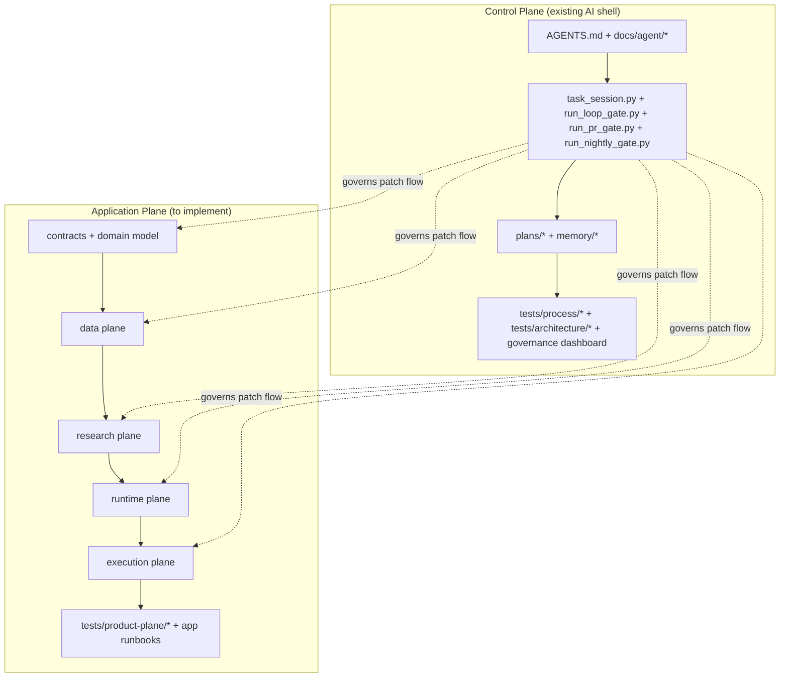
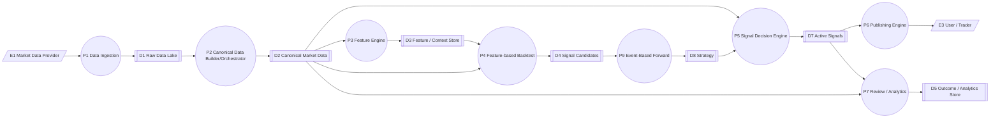

# 01. Architecture Overview

## 1. Общая идея

Архитектура состоит из двух больших контуров:

1. **Control plane** — уже существующий AI delivery shell.
2. **Application plane** — платформа сигналов по MOEX futures, описанная этим ТЗ.

Control plane управляет:
- процессом,
- контекстом Codex,
- validation и gates,
- durable state разработки,
- governance reporting.

Application plane управляет:
- market data,
- features/backtests,
- runtime signals,
- Telegram publishing,
- paper/live execution,
- analytics.

## 2. Combined architecture map

## 3. Верхнеуровневая DFD продукта

## 4. Plane decomposition

### 4.1 Data plane
Ответственность:
- ingestion,
- normalization,
- canonical data,
- session/roll correctness.

Технологии:
- Delta Lake,
- Spark (scoped heavy compute),
- PyArrow local dataframe/query path (ADR-011 replacement for Polars/DuckDB),
- Dagster.

### 4.2 Research plane
Ответственность:
- features,
- backtest,
- walk-forward,
- candidate scoring,
- shadow-forward.

Технологии:
- Python,
- internal backtest engine (`src/trading_advisor_3000/product_plane/research/backtest/engine.py`),
- Delta,
- Dagster.

### 4.3 Runtime plane
Ответственность:
- signal decision,
- signal lifecycle,
- Telegram publishing,
- review/analytics.

Технологии:
- Python,
- PostgreSQL,
- FastAPI,
- custom Bot API publication engine (`TelegramPublicationEngine`).

### 4.4 Execution plane
Ответственность:
- order intents,
- broker order/fill sync,
- positions,
- reconciliation,
- live/paper separation.

Технологии:
- Python contracts,
- .NET 8 StockSharp sidecar,
- QUIK connector,
- Finam execution path.

## 5. Ключевая граница: shell vs product

### Shell owns
- task lifecycle,
- context routing,
- validation and governance,
- plans/memory/state of work,
- CI lane semantics,
- skills governance.

### Product owns
- business/domain logic,
- data contracts,
- strategies,
- signal lifecycle,
- runtime services,
- execution integration,
- product analytics.

## 6. Основные architectural decisions

1. **Data lake contract first** — Delta как долгоживущий storage contract.
2. **Heavy compute separate from runtime** — Spark не входит в live decision path.
3. **Execution sidecar** — StockSharp интегрируется как внешний execution bridge.
4. **Forward and live share strategy contracts**.
5. **Control plane and app plane remain loosely coupled** — через процесс, а не через runtime imports.

6. **F1-B terminal replaceable stack policy** — aiogram/Polars/DuckDB/vectorbt/Alembic/OpenTelemetry are resolved through ADR-011 terminal decisions and must not reappear as active chosen stack items.

## 7. Что не входит в MVP

- direct MOEX DMA,
- full portfolio optimizer,
- fundamentals/news ingestion,
- low-latency tick-driven engine,
- automated strategy self-promotion without human governance.
