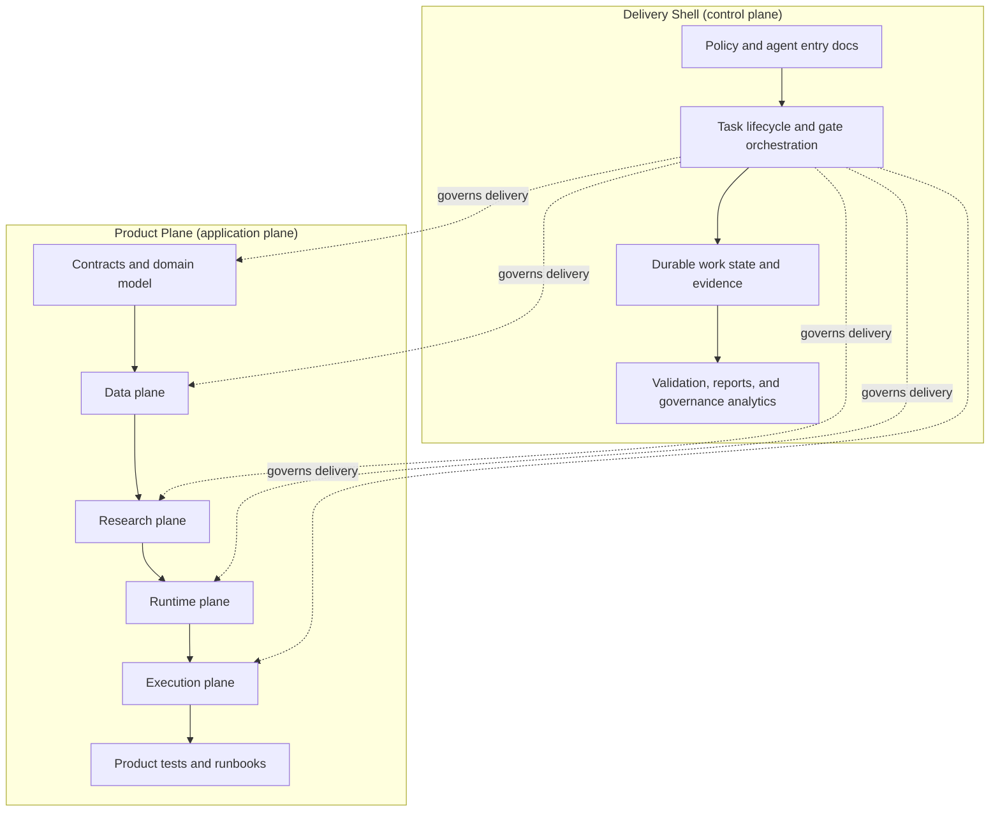
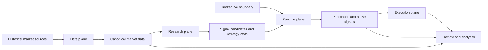

# Trading Advisor 3000 Canonical Architecture Map

## Purpose
This document is the canonical orientation map for the whole repository.
Read it first when you need one coherent architecture picture before diving into
the more detailed shell or product-plane documents.

It is an entry map, not a replacement for detailed source-of-truth documents.
Use it to understand the system shape, the main boundaries, and which document
owns which kind of truth.

## System In One View

## Product Flow In One View

## Responsibility Split

| Surface | Owns | Must not do |
| --- | --- | --- |
| `shell` | process policy, lifecycle, gates, durable work state, reports | hold trading business logic or runtime market behavior |
| `product-plane` | contracts, data, research, runtime, execution, app operations | weaken shell governance contracts or move product logic into shell paths |
| `shared architecture docs` | explain the split and connect both surfaces | override product implementation truth or contract truth |

## Current Reality Versus Target Shape
1. The dual-surface split is real and already enforced in repository structure.
2. The product-plane codebase is present under `src/trading_advisor_3000/product_plane/*`.
3. The product spec still contains target-shape material; it is not automatic proof
   that every capability is already implemented.
4. When target design and implemented reality diverge, implemented-reality status
   documents win for implementation claims.

## Canonical Reading Order
1. Whole-repo orientation:
   - [docs/architecture/trading-advisor-3000.md](docs/architecture/trading-advisor-3000.md)
2. Boundary ownership and path mapping:
   - [docs/architecture/repository-surfaces.md](docs/architecture/repository-surfaces.md)
3. Shell layer model and generated shell map:
   - [docs/architecture/layers-v2.md](docs/architecture/layers-v2.md)
   - [docs/architecture/architecture-map-v2.md](docs/architecture/architecture-map-v2.md)
4. Current product implementation reality:
   - [docs/architecture/product-plane/STATUS.md](docs/architecture/product-plane/STATUS.md)
5. Release-blocking product boundaries:
   - [docs/architecture/product-plane/CONTRACT_SURFACES.md](docs/architecture/product-plane/CONTRACT_SURFACES.md)
6. Detailed target product architecture:
   - [docs/architecture/product-plane/product-plane-spec-v2/01_Architecture_Overview.md](docs/architecture/product-plane/product-plane-spec-v2/01_Architecture_Overview.md)

## Interpretation Rules
1. Use this document to orient yourself quickly.
2. Use [repository-surfaces.md](docs/architecture/repository-surfaces.md) when you need exact ownership of paths and change surfaces.
3. Use [STATUS.md](docs/architecture/product-plane/STATUS.md) when the question is "what is real now?"
4. Use [CONTRACT_SURFACES.md](docs/architecture/product-plane/CONTRACT_SURFACES.md) when the question is "which interfaces are release-blocking?"
5. Use the product-plane specification when the question is "what is the intended target shape?"

## Non-Negotiable Architecture Boundaries
1. Shell files stay governance-focused and do not host trading-domain logic.
2. Mixed changes are valid only when one coherent outcome truly needs both surfaces.
3. Shell governs delivery flow; it does not become a product runtime dependency.
4. Historical and batch market data can support research, backfill, and analytics,
   but live intraday decisions remain fail-closed without the broker live boundary
   described in [docs/architecture/product-plane/STATUS.md](docs/architecture/product-plane/STATUS.md).
