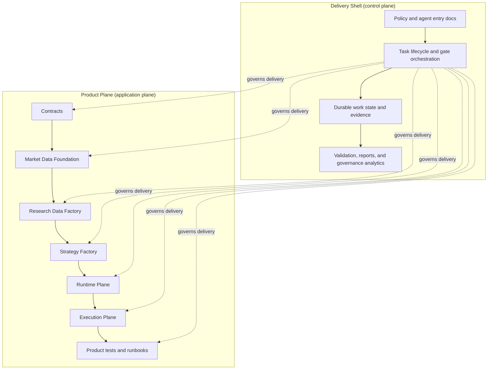
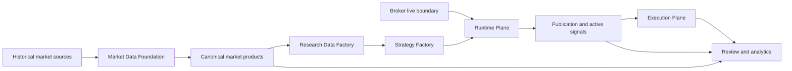

# Trading Advisor 3000 Canonical Architecture Map

## Purpose
This document is the canonical orientation map for the whole repository.
Read it first when you need one coherent architecture picture before diving into
the more detailed shell or product-plane documents.

It is an entry map, not a replacement for detailed source-of-truth documents.
Use it to understand the system shape, the main boundaries, and which document
owns which kind of truth.

## System In One View

## Product Flow In One View

## Responsibility Split

| Surface | Owns | Must not do |
| --- | --- | --- |
| `shell` | process policy, lifecycle, gates, durable work state, reports | hold trading business logic or runtime market behavior |
| `product-plane` | contracts, data, research, runtime, execution, app operations | weaken shell governance contracts or move product logic into shell paths |
| `shared architecture docs` | explain the split and connect both surfaces | override product implementation truth or contract truth |

## Product-Plane Runtime Ownership
Product-plane work has explicit native runtime owners. Spark, Delta Lake,
Dagster, pandas-ta-classic, vectorbt, Optuna, and DuckDB are not incidental
dependencies; they define where the core operation should live.

The architecture rule is:
- use native runtime primitives when the documented library surface owns the
  problem shape;
- keep Python as orchestration, contract adaptation, validation, or explicit
  fallback;
- record the Native Runtime Choice before non-trivial data, research, compute,
  optimization, or orchestration changes.

Canonical ownership matrix:
- [docs/architecture/product-plane/native-runtime-ownership.md](docs/architecture/product-plane/native-runtime-ownership.md)

## Product-Plane Modular Structure
The product plane is organized as deep modules, not as a flat package tree:

- Contracts define the shared vocabulary and versioned boundary payloads.
- Market Data Foundation owns raw/canonical market truth, sessions, roll maps,
  freshness, and baseline evidence.
- Research Data Factory owns research-ready frames, indicators, derived
  indicators, materialization manifests, and point-in-time research data rules.
- Strategy Factory owns strategy definitions, campaign/search specs, vectorbt
  and Optuna research execution, rankings, findings, and projected candidates.
- Runtime Plane owns signal lifecycle, publication lifecycle, durable runtime
  state, replay/outcome observations, and operator-facing runtime API behavior.
- Execution Plane owns order intent handoff, broker/sidecar transport, paper and
  controlled live execution, reconciliation, and execution proof.

Each module may be internally complex, but it must expose a narrow public API.
Neighboring modules may depend on Contracts or explicit public API surfaces, but
must not import private implementation details such as storage helpers, jobs,
`_common` modules, runtime-private wiring, or data layout mechanics.

Canonical module ownership map:
- [docs/architecture/product-plane/product-plane-module-charters.md](docs/architecture/product-plane/product-plane-module-charters.md)

Canonical module API map:
- [docs/architecture/product-plane/product-plane-module-apis.md](docs/architecture/product-plane/product-plane-module-apis.md)

## Current Reality Versus Target Shape
1. The dual-surface split is real and already enforced in repository structure.
2. The product-plane codebase is present under `src/trading_advisor_3000/product_plane/*`.
3. The old product-plane spec v2 package is archived target-shape material; it
   is not automatic proof that every capability is already implemented.
4. When target design and implemented reality diverge, implemented-reality status
   documents win for implementation claims.
5. Old task notes, TZ/package-intake artifacts, and phase reports are historical
   evidence unless a current truth document explicitly promotes them.

## Canonical Reading Order
1. Whole-repo orientation:
   - [docs/architecture/trading-advisor-3000.md](docs/architecture/trading-advisor-3000.md)
2. Boundary ownership and path mapping:
   - [docs/architecture/repository-surfaces.md](docs/architecture/repository-surfaces.md)
3. Shell layer model and generated shell map:
   - [docs/architecture/layers-v2.md](docs/architecture/layers-v2.md)
   - [docs/architecture/architecture-map-v2.md](docs/architecture/architecture-map-v2.md)
4. Current product implementation reality:
   - [docs/architecture/product-plane/STATUS.md](docs/architecture/product-plane/STATUS.md)
5. Current reset and recovery truth:
   - [docs/project-map/current-truth-map-2026-05-05.md](docs/project-map/current-truth-map-2026-05-05.md)
   - [docs/project-map/product-reset-audit-2026-05-05.md](docs/project-map/product-reset-audit-2026-05-05.md)
   - [docs/project-map/documentation-reality-audit-2026-05-05.md](docs/project-map/documentation-reality-audit-2026-05-05.md)
6. Product-plane native runtime ownership:
   - [docs/architecture/product-plane/native-runtime-ownership.md](docs/architecture/product-plane/native-runtime-ownership.md)
7. Product-plane module boundary overlay:
   - [docs/architecture/product-plane/product-plane-module-charters.md](docs/architecture/product-plane/product-plane-module-charters.md)
8. Product-plane module API map:
   - [docs/architecture/product-plane/product-plane-module-apis.md](docs/architecture/product-plane/product-plane-module-apis.md)
9. Release-blocking product boundaries:
   - [docs/architecture/product-plane/CONTRACT_SURFACES.md](docs/architecture/product-plane/CONTRACT_SURFACES.md)
10. Current research-plane platform shape:
   - [docs/architecture/product-plane/research-plane-platform.md](docs/architecture/product-plane/research-plane-platform.md)
11. Claim-control stack baseline:
   - [docs/architecture/product-plane/stack-conformance-baseline.md](docs/architecture/product-plane/stack-conformance-baseline.md)

## Interpretation Rules
1. Use this document to orient yourself quickly.
2. Use [repository-surfaces.md](docs/architecture/repository-surfaces.md) when you need exact ownership of paths and change surfaces.
3. Use [STATUS.md](docs/architecture/product-plane/STATUS.md) when the question is "what is real now?"
4. Use [CONTRACT_SURFACES.md](docs/architecture/product-plane/CONTRACT_SURFACES.md) when the question is "which interfaces are release-blocking?"
5. Use [product-plane-module-charters.md](docs/architecture/product-plane/product-plane-module-charters.md) when the question is "which product-plane module owns this capability, storage, runtime, or proof surface?"
6. Use [product-plane-module-apis.md](docs/architecture/product-plane/product-plane-module-apis.md) when the question is "which public API may this module import or expose?"
7. Use the archived product-plane spec v2 package only when the question is
   explicitly about historical target-shape provenance.

## Non-Negotiable Architecture Boundaries
1. Shell files stay governance-focused and do not host trading-domain logic.
2. Mixed changes are valid only when one coherent outcome truly needs both surfaces.
3. Shell governs delivery flow; it does not become a product runtime dependency.
4. Historical and batch market data can support research, backfill, and analytics,
   but live intraday decisions remain fail-closed without the broker live boundary
   described in [docs/architecture/product-plane/STATUS.md](docs/architecture/product-plane/STATUS.md).
5. Product-plane runtime work must choose the native runtime owner before custom
   Python owns logic that Spark, Delta Lake, Dagster, pandas-ta-classic,
   vectorbt, Optuna, or DuckDB already covers.
6. Product-plane modules communicate through Contracts or explicit public module
   APIs; private implementation imports across module boundaries are not a
   stable architecture surface.
