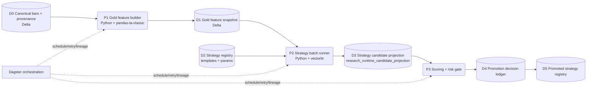

# ТЗ: MOEX Data-to-Strategy Pipeline (Spark + pandas-ta-classic + vectorbt + Dagster)

Дата: 2026-04-11
Статус: governed planning baseline (implementation deferred)

## 0. Рамка текущего прохода

- Этот документ фиксирует целевую архитектуру и правила реализации, но не подтверждает факт реализации.
- В рамках текущего governed-прохода изменяется только ТЗ и связанные planning-артефакты.
- Любые кодовые изменения пайплайна, контрактов и рантайма выполняются отдельным внедренческим проходом после утверждения ТЗ.

## 1. Контекст и решение по скоупу

### 1.1 Что считаем закрытым
- Исторический baseline зафиксирован в data-root layout:
  - raw: `D:/TA3000-data/trading-advisor-3000-nightly/raw/moex/baseline-4y-current`
  - canonical: `D:/TA3000-data/trading-advisor-3000-nightly/canonical/moex/baseline-4y-current`
- Каноничные бары и provenance уже существуют и остаются входом для research-контура.
- `Finam live market data` остается оперативным источником для runtime decision in the moment.

### 1.2 Что добавляем в этот ТЗ
- Полный поток от каноничных данных до стратегии: `canonical -> gold -> vectorbt -> scoring -> promotion`.
- Явное разделение ролей стека: Spark, `pandas-ta-classic`, vectorbt, Dagster.
- Формальные контракты между слоями.
- Критерии отбора среднесрочных стратегий с обязательной повторяемостью.

## 2. Цели

1. Сделать воспроизводимый конвейер формирования стратегий из каноничных данных без ручной склейки.
2. Получать стратегические кандидаты в виде формального ledger, а не ad-hoc отчетов.
3. Продвигать в runtime только те стратегии, которые проходят единый набор quality/risk-критериев.
4. Сохранить fail-closed поведение: при нарушении контракта или гейтов продвижение блокируется.

## 3. Границы и non-goals

### 3.1 In scope
- MOEX historical ingest и canonical refresh.
- Gold-слой признаков для среднесрочных стратегий.
- Backtest и генерация strategy candidates в vectorbt.
- Scoring, risk-gates и promotion в governed-контуре.
- Оркестрация всех шагов через Dagster.

### 3.2 Out of scope
- Замена live execution-контуров и брокерного исполнения.
- Внедрение fallback-библиотек индикаторов вместо `pandas-ta-classic`.
- Ручной запуск production-пайплайна через одиночные python-скрипты после cutover.

## 4. Целевой поток и DFD

### Что такое `candidate projection`
- Это канонический результат прогона конкретной стратегии на конкретном снапшоте gold-данных.
- В projection сохраняются:
  - идентификатор стратегии и параметров,
  - используемые инструменты и таймфреймы,
  - правила входа/выхода (в декларативной форме),
  - метрики доходности и риска,
  - ссылка на артефакты прогона,
  - fingerprint воспроизводимости.

## 5. Как сплетаем Spark, pandas-ta-classic, vectorbt и Dagster

### 5.1 Роли компонентов
- Spark: тяжелая подготовка canonical-слоя и технические преобразования больших объемов данных.
- `pandas-ta-classic`: расчет индикаторов и regime/feature-состояний в gold-слое.
- vectorbt: массовый бэктест стратегий-кандидатов на готовом gold-снэпшоте.
- Dagster: оркестрация последовательности, ретраев, гейтов, публикации и lineage.

### 5.2 Межмашинные границы (где «плавают» данные)
- Data machine (Delta/Spark контур): хранит и обновляет canonical-данные.
- Research machine (Python/vectorbt контур): читает gold, запускает бэктест, пишет candidate projection.
- Orchestration machine (Dagster): управляет запуском и состояниями пайплайна.
- Данные между контурами передаются только через versioned Delta-артефакты, без ручного копирования.

## 6. Контракты (что это и зачем)

Контракт в этом ТЗ — это фиксированная версия структуры данных и правил семантики между producer и consumer.

### C-01 `canonical_bar.v1`
- Producer: canonical builder.
- Consumer: gold feature builder.
- Правило: нарушение ключей/таймстемпов блокирует downstream.

### C-02 `gold_feature_snapshot.v1`
- Producer: gold feature builder (`pandas-ta-classic`).
- Consumer: vectorbt runner.
- Правило: состав признаков и naming фиксированы на версию снапшота.

### C-03 `strategy_candidate_projection.v1`
- Producer: vectorbt runner.
- Consumer: scoring gate.
- Правило: без fingerprint воспроизводимости запись считается невалидной.

### C-04 `strategy_scorecard.v1`
- Producer: scoring gate.
- Consumer: promotion gate.
- Правило: оценка должна содержать все обязательные критерии и итоговый verdict.

### C-05 `strategy_promotion_decision.v1`
- Producer: promotion gate.
- Consumer: runtime publication.
- Правило: только `PASS`-решения могут попадать в promoted registry.

## 7. Функциональные требования

### FR-01 Каталог инструментов и диверсификация
- Должен существовать whitelist инструментов и их стабильные идентификаторы.
- Стратегии-кандидаты обязаны использовать несколько инструментов, а не один.

### FR-02 Источники и приоритет
- Для истории и backfill приоритетный источник MOEX ISS.
- Для live runtime сохраняется отдельный контур оперативного источника.

### FR-03 Инкрементальное обновление canonical
- Обновление идет инкрементально и идемпотентно, без full-rebuild baseline.

### FR-04 Таймфреймы для среднесрока
- Из research-контура убирается `5m`.
- Обязательный набор таймфреймов: `15m`, `1h`, `4h`, `1d`, `1w`.
- `1d` является обязательным таймфреймом для оценки устойчивости стратегии.

### FR-05 Gold-слой признаков
- Отдельная job формирует gold-срезы с индикаторами, regime и служебными фичами.
- Для индикаторов используется только `pandas-ta-classic`.
- Фоллбэки на альтернативные TA-библиотеки в production-контуре запрещены.

### FR-06 Базовые семейства стратегий
- В ТЗ фиксируются как минимум:
  - trend-following,
  - mean-reversion,
  - breakout/volatility.
- Каждое семейство хранится как шаблон в strategy registry с параметрами и правилами входа/выхода.

### FR-07 Candidate projection и ledger
- Каждый прогон vectorbt обязан записывать candidate projection в единый ledger.
- Прогоны без записи в ledger считаются недействительными для promotion.

### FR-08 Scoring и риск-гейты
- Scoring рассчитывается на базе капитала `1 000 000 RUB`.
- Sharpe и риск-ограничения обязательны и применяются на этапе promotion gate.
- Значения порогов шарпа/риска хранятся в конфигурации и версионируются.

### FR-09 Повторяемость
- Повторный запуск на том же gold-снэпшоте и той же конфигурации должен давать идентичный verdict.
- Для проверки используется fingerprint прогона.

### FR-10 Наблюдаемость
- Для каждого шага публикуются метрики качества, времени, объема и итоговый статус.

### FR-11 Fail-closed поведение
- При нарушении контракта, QC или risk-гейта стратегия не продвигается дальше.

## 8. Job-контур и оркестрация Dagster

### JOB-01 `moex_incremental_ingest`
- Назначение: дозагрузка новых исторических баров.

### JOB-02 `canonical_bars_builder`
- Назначение: нормализация и сборка каноничных баров с provenance.

### JOB-03 `gold_feature_builder`
- Назначение: сборка gold-срезов признаков для research.
- Стек: Python + `pandas-ta-classic`.

### JOB-04 `strategy_batch_runner`
- Назначение: массовый прогон шаблонов стратегий.
- Стек: Python + vectorbt.

### JOB-05 `strategy_scoring_gate`
- Назначение: расчет scorecard и проверка обязательных критериев.

### JOB-06 `promotion_publish`
- Назначение: публикация только прошедших стратегий в promoted registry.

### Orchestration policy
- Все job запускаются через Dagster.
- Последовательность фиксирована: `canonical -> gold -> backtest -> scoring -> promotion`.
- Ручные обходы пайплайна запрещены вне recovery-процедуры.

## 9. Delta модель данных

### 9.1 Базовые таблицы
- `raw_moex_history.delta`
- `canonical_bars.delta`
- `canonical_bar_provenance.delta`
- `canonical_session_calendar.delta`
- `canonical_roll_map.delta`

### 9.2 Gold и research таблицы
- `gold_feature_snapshot.delta`
- `strategy_registry.delta`
- `research_runtime_candidate_projection.delta`
- `strategy_scorecard.delta`
- `strategy_promotion_decision.delta`
- `promoted_strategy_registry.delta`

### 9.3 Правило совместимости
- Любое изменение контрактных полей выполняется как versioned schema change с миграцией и тестами.

## 10. Критерии отбора стратегий (обязательные)

### A. Устойчивость
- Горизонт проверки: 4 года.
- Не допускаются месяцы с отрицательной доходностью.

### B. Доходность
- Годовая доходность стратегии должна быть выше `30%`.

### C. Диверсификация
- Стратегия обязана работать на нескольких активах.
- Концентрация на одном активе как единственном источнике результата не допускается.

### D. Частота сигналов
- Не менее `2` сигналов в неделю в среднем на контрольном горизонте.

### E. Повторяемость
- Повторный прогон обязан давать тот же итоговый вердикт при неизменных входных данных и параметрах.

### F. Капитал и риск
- Базовый капитал для моделирования: `1 000 000 RUB`.
- Sharpe и риск-лимиты обязательны; пороги задаются в versioned config и входят в scorecard.

## 11. NFR и SLO

1. Идемпотентность: повторный запуск не создает дубликаты.
2. Воспроизводимость: одинаковые входы дают одинаковый результат.
3. Наблюдаемость: метрики и run-evidence доступны по каждому этапу.
4. Производительность: ночной цикл завершает полный pipeline до окна утреннего анализа.
5. Безопасность потока: любые нарушения контракта останавливают продвижение дальше по DAG.

## 12. План внедрения

### Этап 1: Data foundation
- стабилизация ingest и canonical,
- фиксация контрактов C-01/C-02.

### Этап 2: Gold layer
- запуск `gold_feature_builder`,
- проверка детерминированности и качества признаков.

### Этап 3: Strategy factory
- запуск `strategy_batch_runner`,
- materialization candidate projection и scorecard.

### Этап 4: Promotion
- запуск promotion gate,
- публикация прошедших стратегий в promoted registry.

### Этап 5: Operational hardening
- отработка recovery-процедур,
- финальный governance cutover на Dagster-only маршрут.

## 13. Риски и меры

1. Переусложнение gold-слоя
   Мера: versioned набор признаков и staged-расширение.
2. Нестабильность метрик между прогонами
   Мера: fingerprint + фиксированные snapshot-входы + fail-closed при расхождении.
3. Концентрация на одном активе
   Мера: обязательный диверсификационный gate в scorecard.
4. Размывание требований при ручных обходах
   Мера: Dagster-only orchestration и формальная recovery-процедура.

## 14. Решение по продуктовой логике

- Базовая архитектура упрощена до одного прозрачного потока от canonical к стратегии.
- `pandas-ta-classic` зафиксирован как единственная библиотека индикаторов в governed-контуре.
- Среднесрочный профиль закреплен через обновленный набор таймфреймов (`1d` добавлен, `5m` удален).
- Базовые семейства стратегий теперь явно описаны в ТЗ и привязаны к формальному scoring/promotion процессу.
