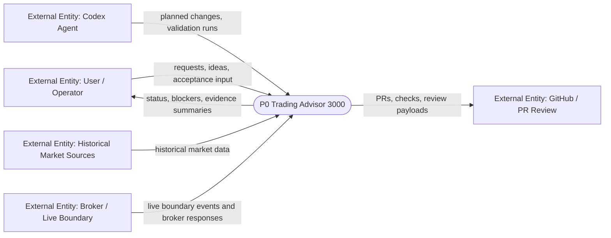

# DFD Level 0 - System Context

Purpose: show TA3000 as one system boundary. Level 0 intentionally does not
show internal stores; those belong in Level 1 and Level 2 maps where concrete
paths and table names can be used.

## Boundary Notes

- Delivery Shell and Product Plane are both inside `P0 Trading Advisor 3000`.
- Delivery Shell moves policy, task state, diff state, checks, and evidence.
- Product Plane moves product contracts, market data, research artifacts,
  runtime state, publications, and execution records.
- Historical/batch data is not a valid intraday live-decision source.

## Next Level

- [Level 1 - Delivery Shell](docs/obsidian/dfd/level-1-delivery-shell.md)
- [Level 1 - Product Plane](docs/obsidian/dfd/level-1-product-plane.md)
