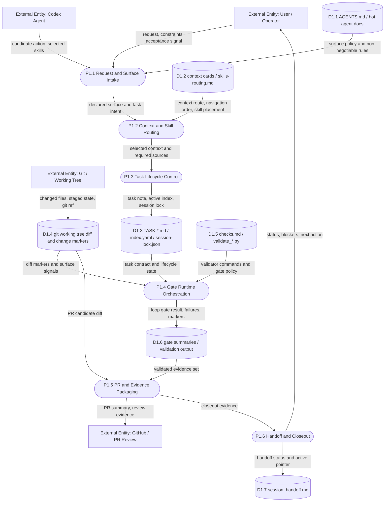

# DFD Level 1 - Delivery Shell

Purpose: show the Delivery Shell as a control plane. It moves requests, policy,
context, diff state, task state, validation results, and evidence.

It does not move product market data and it must not own trading business logic.

## What This Means

Delivery Shell is not a single linear script. It is a control plane made of:

| Control-plane area | Main responsibility |
| --- | --- |
| Policy and routing | Decide surface, context, skills, and source-of-truth path |
| Task lifecycle | Persist active work state, task contract, and handoff pointer |
| Gate runtime | Convert diff and task state into scoped validation commands |
| PR/evidence packaging | Turn checks and artifacts into reviewable closeout evidence |

## Store Discipline

Every Shell store in this DFD is path-backed or command-backed, but labels stay
short. Full paths belong in the linked source docs.

## Decomposed Shell Maps

- [Level 2 - Shell Context And Task Lifecycle](docs/obsidian/dfd/level-2-shell-context-and-task-lifecycle.md)
- [Level 2 - Shell Gate Runtime](docs/obsidian/dfd/level-2-shell-gate-runtime.md)
- [Level 2 - Shell PR And Evidence](docs/obsidian/dfd/level-2-shell-pr-and-evidence.md)

## Shell Boundary Rules

- `shell` owns process policy, lifecycle, gates, durable work state, and reports.
- `shell` must not hold trading business logic or runtime market behavior.
- Product-plane implementation truth stays in product-plane status and contracts.
