# DFD Level 1 - Product Plane

Purpose: show the product-plane data movement with real storage groups. This
map stays coarse; Level 2 maps name concrete tables and paths.

```mermaid
flowchart LR
    Market["External Entity: Historical Market Sources"]
    Broker["External Entity: Broker / Live Boundary"]
    Operator["External Entity: Operator"]

    P21(["P2.1 Maintain MOEX Raw and Canonical Baseline"])
    P22(["P2.2 Materialize Research Inputs"])
    P23(["P2.3 Produce Strategy Evidence"])
    P24(["P2.4 Run Runtime Signal Lifecycle"])
    P25(["P2.5 Publish / Execute / Reconcile"])

    D21[("D2.1 raw_moex_history.delta / canonical_bars.delta")]
    D22[("D2.2 research_indicator_frames.delta / research_derived_indicator_frames.delta")]
    D23[("D2.3 research runs, rankings, findings, candidates")]
    D24[("D2.4 PostgresSignalStore runtime state")]
    D25[("D2.5 schemas, fixtures, release_blocking_contracts.v1.yaml")]
    D26[("D2.6 orders, fills, events, position/risk snapshots")]

    Market -->|"raw candles and reference payloads"| P21
    P21 -->|"raw_moex_history.delta, canonical_bars.delta, QC evidence"| D21
    D21 -->|"accepted canonical baseline"| P22
    P22 -->|"research datasets, indicators, derived frames"| D22
    D22 -->|"research-ready tables"| P23
    D25 -->|"schema and compatibility constraints"| P23
    P23 -->|"backtests, rankings, findings, candidates"| D23
    D23 -->|"candidate projections"| P24
    P24 -->|"runtime signals, events, publications"| D24
    Operator -->|"review, close, cancel input"| P24
    D24 -->|"publishable decisions and order intent context"| P25
    D25 -->|"execution DTO and sidecar wire contracts"| P25
    Broker -->|"broker responses, fills, updates"| P25
    P25 -->|"orders, fills, broker events, snapshots"| D26
```

## Real Store Rule

If a DFD data store cannot be tied to one of these forms, it should not be shown
as a store. The diagram label should still stay short:

- an on-disk repo path;
- an external data root path;
- a named Delta table/folder;
- a named database-backed store;
- a named evidence artifact path;
- a versioned contract/schema/fixture/test inventory.

## Next Level

- [Level 2 - Data Plane](docs/obsidian/dfd/level-2-data-plane.md)
- [Level 2 - Research To Runtime](docs/obsidian/dfd/level-2-research-to-runtime.md)
- [Level 2 - Contracts And Execution](docs/obsidian/dfd/level-2-contracts-and-execution.md)
