# DFD Level 2 - Contracts And Execution

Purpose: show release-blocking contract storage and the execution boundary. This
map avoids invented execution stores; durable runtime state is the
`PostgresSignalStore`, while contract truth is path-backed in the repository.

```mermaid
flowchart LR
    Reviewer["External Entity: Reviewer / PR Gate"]
    Operator["External Entity: Operator"]
    Broker["External Entity: Broker / Sidecar Boundary"]

    P271(["P2.7.1 Version Boundary Contracts"])
    P272(["P2.7.2 Validate Contract Compatibility"])
    P251(["P2.5.1 Publish Runtime Decision"])
    P261(["P2.6.1 Submit / Cancel / Replace Intent"])
    P262(["P2.6.2 Record Execution Observations"])
    P263(["P2.6.3 Reconcile Runtime State"])

    D271[("D2.7.1 *.v1.json schemas")]
    D272[("D2.7.2 contract fixtures")]
    D273[("D2.7.3 contract tests")]
    D274[("D2.7.4 release_blocking_contracts.v1.yaml")]
    D241[("D2.4.1 PostgresSignalStore: signals, events, publications")]
    D261[("D2.6.1 order_intent, broker_order, broker_fill schemas")]
    D262[("D2.6.2 sidecar_* wire envelope schemas")]
    D263[("D2.6.3 broker_event, position_snapshot, risk_snapshot schemas")]
    D264[("D2.6.4 execution/reconciliation evidence from tests and rollout reports")]

    Reviewer -->|"contract change request"| P271
    P271 -->|"schema versions"| D271
    P271 -->|"matching fixtures"| D272
    D271 -->|"schema IDs and compatibility class"| P272
    D272 -->|"example payloads"| P272
    D273 -->|"contract test suite"| P272
    P272 -->|"release-blocking inventory update"| D274
    D274 -->|"compatibility constraints"| P251
    D241 -->|"runtime decision and publication state"| P251
    Operator -->|"publish, close, cancel input"| P251
    P251 -->|"publication event"| D241
    D261 -->|"order DTO constraints"| P261
    D262 -->|"sidecar wire constraints"| P261
    D241 -->|"order intent context"| P261
    P261 -->|"submit/cancel/replace request"| Broker
    Broker -->|"orders, fills, updates, errors"| P262
    P262 -->|"broker event and snapshot payloads"| D263
    D263 -->|"observed execution state"| P263
    D241 -->|"expected signal/publication state"| P263
    P263 -->|"reconciliation and rollout evidence"| D264
    D264 -->|"review evidence"| Reviewer
```

## Store Notes

- Contract source of truth is repo-backed: schemas, fixtures, contract tests, and
  release-blocking inventory must align. Full paths stay in
  [Contract Surfaces](docs/architecture/product-plane/CONTRACT_SURFACES.md).
- Runtime signal state is durable only when profile wiring uses
  `PostgresSignalStore`.
- Real broker process closure is not claimed by this map; the broker boundary is
  still governed by status and rollout evidence.

## Parent Map

- [Level 1 - Product Plane](docs/obsidian/dfd/level-1-product-plane.md)
