# DFD Level 2 - Data Plane

Purpose: show the real data-plane stores for the MOEX historical route and
canonical baseline. This map keeps process detail limited to the storage
boundaries that matter.

```mermaid
flowchart LR
    Market["External Entity: MOEX / Historical Market Sources"]
    Dagster["External Entity: Dagster Schedule / Operator Launch"]

    P211(["P2.1.1 Raw Ingest"])
    P212(["P2.1.2 Canonical Refresh"])
    P213(["P2.1.3 QC and Baseline Pinning"])
    P214(["P2.1.4 Research Handoff"])

    D211[("D2.1.1 raw_moex_history.delta")]
    D212[("D2.1.2 universe and mapping registry")]
    D213[("D2.1.3 canonical_bars.delta")]
    D214[("D2.1.4 canonical_session_calendar.delta / canonical_roll_map.delta")]
    D215[("D2.1.5 baseline manifest and QC artifacts")]
    D216[("D2.1.6 data-prep inputs")]

    Dagster -->|"scheduled run, partition, cursor"| P211
    Market -->|"raw candles and reference payloads"| P211
    P211 -->|"raw Delta writes"| D211
    D212 -->|"instrument mapping and contract chain rules"| P211
    D211 -->|"raw source rows"| P212
    D212 -->|"resolved universe and mapping"| P212
    P212 -->|"canonical_bar.v1 rows"| D213
    P212 -->|"calendar and roll metadata"| D214
    D213 -->|"canonical baseline"| P213
    D214 -->|"alignment metadata"| P213
    P213 -->|"pinned baseline and quality evidence"| D215
    D215 -->|"accepted baseline reference"| P214
    D213 -->|"canonical rows"| P214
    P214 -->|"data-prep inputs"| D216
```

## Store Notes

- Diagram labels use short store names.
- Authoritative full paths live in the product-plane status and runbooks.
- Verification roots are proof roots, not live current storage.

## Parent Map

- [Level 1 - Product Plane](docs/obsidian/dfd/level-1-product-plane.md)
