# DFD Level 2 - Research To Runtime

Purpose: show how persisted research Delta outputs feed runtime signal state.
This map uses table families from the current research platform instead of
generic "feature store" labels.

```mermaid
flowchart LR
    Operator["External Entity: Operator"]

    P221(["P2.2.1 Research Data Prep"])
    P231(["P2.3.1 Strategy Registry and Campaign Materialization"])
    P232(["P2.3.2 Backtest and Ranking"])
    P241(["P2.4.1 Runtime Candidate Replay"])
    P242(["P2.4.2 Durable Runtime Signal Store"])

    D221[("D2.2.1 research_datasets and research_bar_views")]
    D222[("D2.2.2 research_indicator_frames.delta")]
    D223[("D2.2.3 research_derived_indicator_frames.delta")]
    D231[("D2.3.1 research_strategy_families/templates/instances")]
    D232[("D2.3.2 research_backtest_batches/runs/stats/trades/orders/drawdowns")]
    D233[("D2.3.3 research_strategy_rankings, research_run_findings, research_signal_candidates")]
    D234[("D2.3.4 research_run_stats_index, research_rankings_index, research_strategy_notes")]
    D241[("D2.4.1 PostgresSignalStore: signals, events, publications")]

    D221 -->|"research bars"| P221
    P221 -->|"indicator table"| D222
    P221 -->|"derived indicator table"| D223
    Operator -->|"strategy inventory or campaign request"| P231
    D222 -->|"indicator inputs"| P231
    D223 -->|"derived inputs"| P231
    P231 -->|"strategy registry tables"| D231
    D231 -->|"campaign instances"| P232
    D222 -->|"indicator frames"| P232
    D223 -->|"derived frames"| P232
    P232 -->|"portfolio and run artifacts"| D232
    P232 -->|"rankings, findings, candidates"| D233
    P232 -->|"run indexes and notes"| D234
    D233 -->|"candidate projections"| P241
    Operator -->|"review, close, cancel input"| P241
    P241 -->|"runtime signal events"| P242
    P242 -->|"durable runtime state"| D241
```

## Store Notes

- Diagram labels use table and store names, not full paths.
- Verification roots are proof roots and should not be treated as live current.
- Backtest/ranking consumers should re-read persisted Delta outputs instead of
  passing large row lists through orchestration handoffs.

## Parent Map

- [Level 1 - Product Plane](docs/obsidian/dfd/level-1-product-plane.md)
