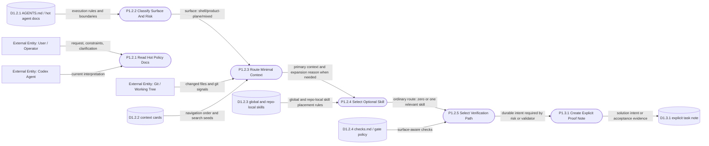

# DFD Level 2 - Shell Context And Skill Routing

Purpose: decompose Shell request intake, surface/risk classification, context
routing, skill routing, and explicit proof-note selection.

## Key Distinction

The ordinary route does not create a session, handoff pointer, or long process
record. Durable notes are explicit proof artifacts for specific risks, not
navigation memory.

Product proof is produced by the relevant product-plane route and then
referenced by Shell evidence.

## Parent Map

- [Level 1 - Delivery Shell](docs/obsidian/dfd/level-1-delivery-shell.md)
