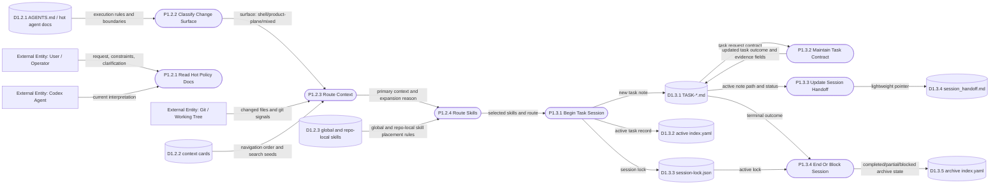

# DFD Level 2 - Shell Context And Task Lifecycle

Purpose: decompose Shell request intake, context routing, skill routing, task
session creation, and handoff state.

## Key Distinction

This map is about state control for the work session. It does not prove product
behavior. Product proof is produced by the relevant product-plane route and then
referenced by Shell evidence.

## Parent Map

- [Level 1 - Delivery Shell](docs/obsidian/dfd/level-1-delivery-shell.md)
