# DFD Level 2 - Shell Gate Runtime

Purpose: decompose how Shell turns task state and repository diff into scoped
validation commands and gate results.

```mermaid
flowchart LR
    Agent["External Entity: Codex Agent"]
    Git["External Entity: Git / Working Tree"]

    P141(["P1.4.1 Collect Diff Snapshot"])
    P142(["P1.4.2 Derive Surface and Markers"])
    P143(["P1.4.3 Resolve Check Profile"])
    P144(["P1.4.4 Run Contract Validators"])
    P145(["P1.4.5 Run Contour Validators"])
    P146(["P1.4.6 Run Docs and Naming Validators"])
    P147(["P1.4.7 Emit Gate Result"])

    D131[("D1.3 TASK-*.md and session-lock.json")]
    D141[("D1.4 git diff, git ref, changed file list")]
    D142[("D1.4 critical contour markers from changed files")]
    D151[("D1.5 checks.md")]
    D152[("D1.5 validate_*.py and scoped gate helpers")]
    D161[("D1.6 run_loop_gate.py output")]
    D162[("D1.6 failing command and remediation diagnostics")]

    Agent -->|"gate command and profile request"| P141
    Git -->|"git ref, changed files, staged state"| P141
    P141 -->|"snapshot"| D141
    D141 -->|"changed paths"| P142
    D131 -->|"task contract and surface declaration"| P142
    P142 -->|"surface markers, contour markers"| D142
    D142 -->|"profile inputs"| P143
    D151 -->|"available check definitions"| P143
    P143 -->|"scoped check plan"| P144
    D152 -->|"session, task, phase, solution validators"| P144
    P144 -->|"contract validation result"| P145
    D152 -->|"critical contour, stack, recomposition validators"| P145
    P145 -->|"contour validation result"| P146
    D152 -->|"docs links, naming, skills validators"| P146
    P146 -->|"combined result"| P147
    P147 -->|"pass/fail and command trace"| D161
    P147 -->|"failing command, reason, remediation signal"| D162
```

## Gate Runtime Rules

- `run_loop_gate.py` is the canonical hot-path gate.
- Gate inputs are task state, diff state, surface markers, and check matrix.
- Gate output is evidence and failure diagnostics, not product logic.

## Parent Map

- [Level 1 - Delivery Shell](docs/obsidian/dfd/level-1-delivery-shell.md)
