# DFD Level 2 - Shell PR And Evidence

Purpose: decompose PR closeout and evidence packaging. This is the review lane
around a candidate diff, not the product implementation itself.

```mermaid
flowchart LR
    Agent["External Entity: Codex Agent"]
    Git["External Entity: Git / Working Tree"]
    GitHub["External Entity: GitHub / PR Review"]
    User["External Entity: User / Operator"]

    P151(["P1.5.1 Build PR Surface Plan"])
    P152(["P1.5.2 Run PR Gate"])
    P153(["P1.5.3 Collect Evidence Artifacts"])
    P154(["P1.5.4 Write Review Summary"])
    P155(["P1.5.5 Publish or Handoff PR State"])
    P161(["P1.6.1 Close Session Outcome"])

    D141[("D1.4 git branch and candidate diff")]
    D151[("D1.5 checks.md PR gate commands")]
    D161[("D1.6 run_loop_gate.py output")]
    D162[("D1.6 pr-gate-summary.md")]
    D163[("D1.6 pr-surface-plan.json / pr-surface-plan.md")]
    D131[("D1.3 TASK-*.md")]
    D171[("D1.7 session_handoff.md")]

    Agent -->|"closeout request"| P151
    Git -->|"candidate diff and branch state"| D141
    D141 -->|"changed files and contours"| P151
    D151 -->|"PR lane checks"| P151
    P151 -->|"surface-aware PR plan"| P152
    D161 -->|"loop gate baseline"| P152
    P152 -->|"PR gate result and summary fields"| D162
    D162 -->|"pass/fail, profile, command trace"| P153
    D141 -->|"diff scope"| P153
    P153 -->|"evidence bundle"| D163
    D163 -->|"verification evidence"| P154
    D131 -->|"task outcome and acceptance fields"| P154
    P154 -->|"review-ready summary"| P155
    P155 -->|"PR body, status, review payload"| GitHub
    P155 -->|"status and remaining blockers"| User
    D162 -->|"terminal gate state"| P161
    D163 -->|"final evidence refs"| P161
    P161 -->|"completed/partial/blocked status"| D131
    P161 -->|"active pointer update"| D171
```

## Evidence Rules

- PR evidence should name what ran, what passed, what failed, and which surface
  the evidence belongs to.
- Shell evidence can reference product-plane proof, but should not replace it.
- Closeout state must distinguish completed, partial, and blocked outcomes.

## Parent Map

- [Level 1 - Delivery Shell](docs/obsidian/dfd/level-1-delivery-shell.md)
