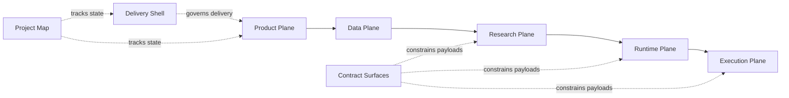
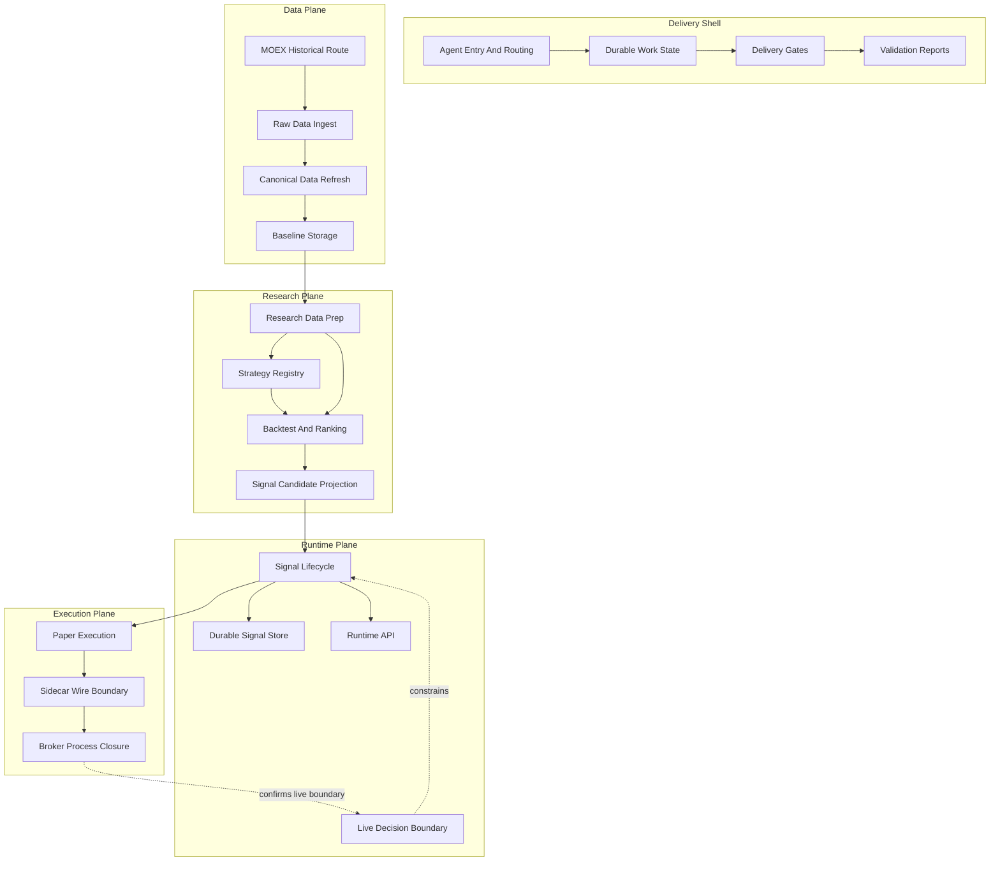

# Project Map Overview

This is the primary visual overview. Use Global Graph only as a secondary
relationship radar.

## Level 1

## Level 2 Lanes

## Open From Here

| Area | Open |
| --- | --- |
| Delivery shell | [[Delivery Shell]] |
| Product plane | [[Product Plane]] |
| Data plane | [[Data Plane]] |
| Research plane | [[Research Plane]] |
| Runtime plane | [[Runtime Plane]] |
| Execution plane | [[Execution Plane]] |
| Contract surfaces | [[Contract Surfaces]] |
| Project map governance | [[Project Map Update Rules]] |

## Supporting Views

- [[project-governance.base|Project Governance]] shows DFD/source/proof refs.
- [[project-attention.base|Project Attention]] shows current attention items.
- [DFD Index](docs/obsidian/dfd/README.md) is the process/data-flow map set.
- [[project-graph|Project Graph Lens]] is secondary, not the primary view.
